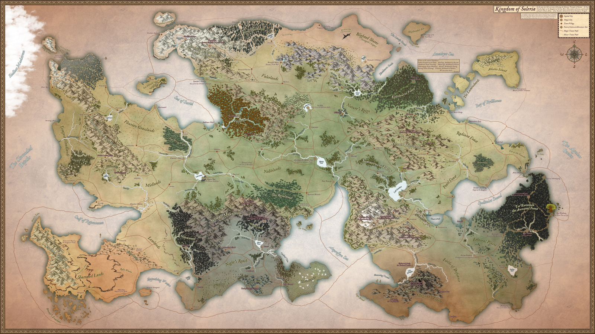

# THE VAULT

<section class="vault-home">
  

    
Campaign archive

    <h1>The Vault</h1>
    
Worlds, maps, factions, mysteries, rules, and table references gathered into one public doorway.

    

      <a class="portal-button" href="settings/">Browse settings</a>
      <a class="portal-button portal-button-secondary" href="running-the-game/">Running the game</a>
    

  

<!-- portal-start:start -->
  

    <a class="portal-start-card" href="settings/">
      Start with worlds
      <strong>Settings</strong>
      <em>Choose a campaign setting, then browse maps, lore, factions, and people.</em>
    </a>
    <a class="portal-start-card" href="running-the-game/">
      Start with play
      <strong>Running the game</strong>
      <em>Find table practices, homebrew rules, and DM-facing guidance.</em>
    </a>
  

<!-- portal-start:end -->

  

    
Campaign settings

    <h2>Choose a world</h2>
    
Each setting opens into its own index of history, regions, factions, people, mysteries, maps, and campaign material.

  

  

    <a class="portal-card portal-card-image" href="settings/aylbyia/">
      
        Unstable kingdoms
        <strong>Aylbyia</strong>
        A large, volatile world of old powers, fractured peoples, and plots already in motion.
      
      
    </a>
    <a class="portal-card portal-card-accent portal-card-desert" href="settings/godshand/">
      
        Desert oasis
        <strong>Godshand</strong>
        A sacred town built around a colossal hand-shaped landmark rising from an unforgiving desert.
      
    </a>
    <a class="portal-card portal-card-accent portal-card-ashes" href="settings/in-the-ashes/">
      
        Liegedom campaign
        <strong>In the Ashes</strong>
        A campaign frame for rebuilding power, managing a domain, and carving order out of ruin.
      
    </a>
    <a class="portal-card portal-card-image" href="settings/middleworld/">
      
        Renewed world
        <strong>Middleworld</strong>
        A world marked by divine calamities, sealed gods, cursed lands, and an empire facing upheaval.
      
      
    </a>
    <a class="portal-card portal-card-image" href="settings/soleria/">
      
        Fractured realm
        <strong>Soleria</strong>
        Kingdoms, factions, old wars, and corrupted frontiers organized around a living world map.
      
      
    </a>
    <a class="portal-card portal-card-image" href="settings/spine-of-the-world/">
      
        Campaign frontier
        <strong>Spine of the World</strong>
        Factions, settlements, magic items, faith, and regional politics across a mapped campaign land.
      
      
    </a>
    <a class="portal-card portal-card-image" href="settings/tales-of-fate/">
      
        Legacy campaign
        <strong>Tales of Fate</strong>
        History, seasons, heroes, organizations, settlements, and a classic campaign world map.
      
      
    </a>
  

  

    <a href="running-the-game/">
      <strong>Running the game</strong>
      Rules, table practices, homebrew, and DM notes.
    </a>
    <a href="references/">
      <strong>References</strong>
      Public reference material and supporting notes.
    </a>
  

</section>

<!-- vault-folder-index:start -->
## Settings

- [[settings/Aylbyia/index|Aylbyia]]
- [[settings/Godshand/index|Godshand]]
- [[settings/In the Ashes/index|In the Ashes]]
- [[settings/Middleworld/index|Middleworld]]
- [[settings/Soleria/index|Soleria]]
- [[settings/Spine of the World/index|Spine of the World]]
- [[settings/Tales of Fate/index|Tales of Fate]]

## Other public areas

- [[running-the-game/index|Running the game]]
- [[references/index|References]]
<!-- vault-folder-index:end -->
