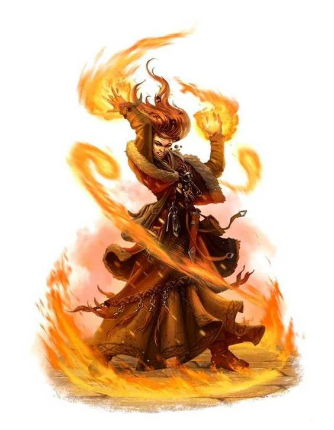
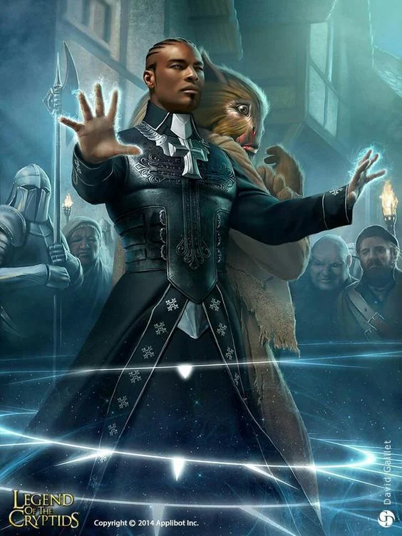
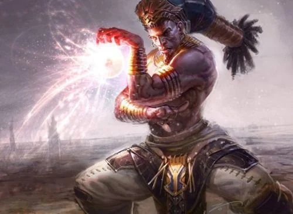

This is magic granted through the manipulation of the [[Natural flow]] and its understanding. It manifests in the harnessing of the space within reach and touching the flow in that space. It is a dangerous effort where harnessing the chaotic energies of this flow is a task to be attempted only with the help of someone to guide you.
<!-- onenote-media:start -->
> [!onenote-hero]
> 

> [!onenote-gallery]
> 
>
> 
<!-- onenote-media:end -->

Gestures and foci are important when your character uses this magic. Equations of magic would be equally important, as such glyphs and runes allow the anchoring of the flow to a certain point in space.

One must be careful when practicing arcane magic and planar transport in particular. The death of [[Cidias]], Celestial of Harmony and order and the ritual that pushed [[Heavens]] away from the [[Plane of Flesh]] disrupted somehow the fabric of the [[ethereal plane]]. Several creatures hide within it and do not always have your best interest in mind. Arcane magic is also subject to erratic behavior in some places.

Some people manifest a powerful pull of the natural flow without any training. These people are taken in by [[Blue Council]] educators in order to teach them how to harness their powers. Some of them escape detection for a very long time and are then hunted down after proof has been obtained of the danger that they pose to the people.

(Mechanically: For players wanting to go for a wild magic sorcerer, we will be using a homebrewed version I have found to be quite a bit more powerful than the PHB one, but can also backfire much more dramatically.)

<!-- vault-enrichment:start -->
## Related

- [[settings/Aylbyia/index|Aylbyia]]
- [[settings/Aylbyia/Cosmology/The cosmos, gods and magic|The cosmos, gods and magic]]
- [[settings/Aylbyia/History/Founding myth|Founding myth]]
- [[settings/Aylbyia/Cosmology/The Planes/Natural flow|Natural flow]]
- [[settings/Aylbyia/Cosmology/Celestials and Saints/Celestials/Cidias|Cidias]]
- [[settings/Aylbyia/Cosmology/The Planes/Heavens|Heavens]]
- [[settings/Aylbyia/Cosmology/The Planes/Plane of Flesh|Plane of Flesh]]
- [[settings/Aylbyia/Cosmology/The Planes/ethereal plane|ethereal plane]]
<!-- vault-enrichment:end -->
