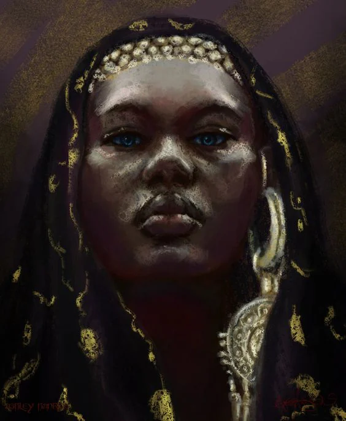
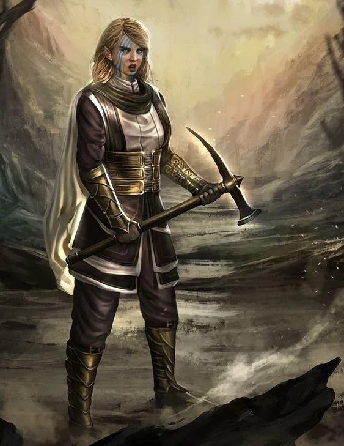

These feats of magic are possible through the channeling of the divine energy that flows towards the [[settings/Aylbyia/Cosmology/The Planes/Plane of Flesh|Plane of Flesh]] and granted by the [[settings/Aylbyia/Cosmology/Celestials and Saints/Celestials/Celestials|Celestials]]. These miracles are obtained through dedicated worship of the [[settings/Aylbyia/Cosmology/Celestials and Saints/Celestials/Celestials|Celestials]].
<!-- onenote-media:start -->
> [!onenote-hero]
> 

> [!onenote-gallery]
> 
<!-- onenote-media:end -->

Women are the only ones who can perform miracles using Divine magic. Men who perform divine magic are seen as heretics, followers and tempters of [[settings/Aylbyia/Regions/Twilight|Twilight]]. Be wary of what magic you use where.

If your character recognizes themself as using this type of magic, it should be reflected somewhere/somehow on their person. Either  through an item of worship or daily rituals they perform. It would also manifest with bright colors and light as motifs for the spells.

DM note: Ranger and Druidic magic are strange in that they fall a little bit outside of the traditional miracles using divine magic and are as such not restrained by your character's gender. Also, although men are seen as unfit for wielding this power, a man who performs this magic can in some rare cases be seen as a sign of that person not being in the appropriate body or vice-versa.

<!-- vault-enrichment:start -->
## Related

- [[settings/Aylbyia/Cosmology/index|Cosmology]]
- [[settings/Aylbyia/index|Aylbyia]]
- [[settings/Aylbyia/Cosmology/The Planes/Celestial flow|Celestial flow]]
- [[settings/Aylbyia/Cosmology/The cosmos, gods and magic|The cosmos, gods and magic]]
- [[settings/Aylbyia/Cosmology/The Planes/Plane of Flesh|Plane of Flesh]]
- [[settings/Aylbyia/Cosmology/Celestials and Saints/Celestials/Celestials|Celestials]]
- [[settings/Aylbyia/Regions/Twilight|Twilight]]
<!-- vault-enrichment:end -->
