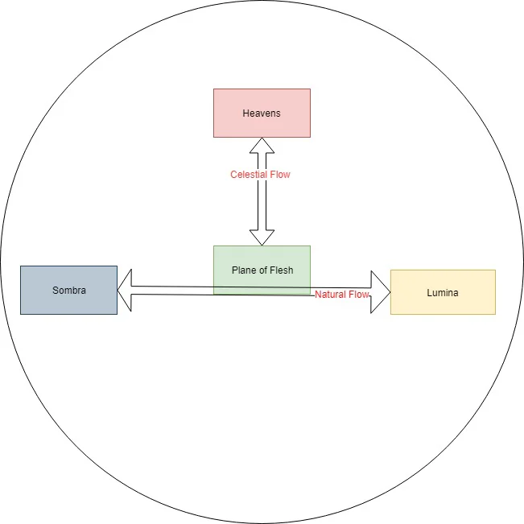

The planes of existence exist as such:
<!-- onenote-media:start -->
> [!onenote-hero]
> 
<!-- onenote-media:end -->

There is a [[Natural flow]] circulating energies of life and death between [[Sombra]] and [[Lumina]]. The [[Celestial flow]] showers with divine energy the [[Plane of Flesh]]. Traversing through the [[ethereal plane]] allows a person to listen into those flows. Beyond the flows lie the [[Astral Sea]], an immense expanse of nothingness, dotted by the stars. Here, the dead await to be welcomed back into the flow by the [[Celestials]] or to ascend.

[[Sombra]] and [[Lumina]]:
[[Heavens]]:
[[Astral Sea]]:
[[Natural flow]]
[[Celestial flow]]

<!-- vault-enrichment:start -->
## Related

- [[settings/Aylbyia/index|Aylbyia]]
- [[settings/Aylbyia/Cosmology/The cosmos, gods and magic|The cosmos, gods and magic]]
- [[settings/Aylbyia/Cosmology/The Planes/Natural flow|Natural flow]]
- [[settings/Aylbyia/Cosmology/The Planes/Sombra|Sombra]]
- [[settings/Aylbyia/Cosmology/The Planes/Lumina|Lumina]]
- [[settings/Aylbyia/Cosmology/The Planes/Celestial flow|Celestial flow]]
- [[settings/Aylbyia/Cosmology/The Planes/Plane of Flesh|Plane of Flesh]]
- [[settings/Aylbyia/Cosmology/The Planes/ethereal plane|ethereal plane]]
<!-- vault-enrichment:end -->
