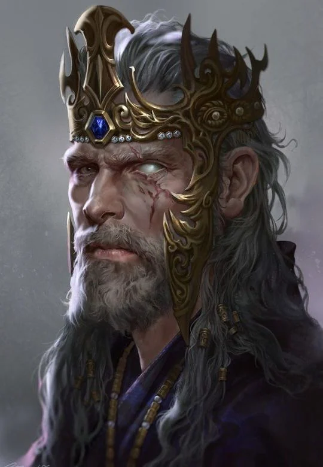

Honored Nature: Courage
<!-- onenote-media:start -->
> [!onenote-hero]
> 

> [!onenote-gallery]
> 
<!-- onenote-media:end -->

Shadow Nature: Arrogance

Capital: [[Ziebglen]], Seat of Aumogonne

Leader: King [[Johan de Meyer]], old veteran of the battlefield. He was maimed during a defense of Klett and was since then forced into taking a more serious hand into politics.

War: Military tactics and the superior use of maneuvers to flank a more numerous army. Heavy use of traps and ambushes.

Commerce: Grain and other produce of the earth.

Politics: Currently controls the [[The Platsmoor|Platsmoor]]. The movement of the Orcish hordes is worrying.

Shadow activities: smuggling of goods and people. Kidnapping of dwarven craftsmiths, ransom.

The people have a normal lifespan in this parts of the world. Some say that the lineage of the king is not blessed like that of the queendom. The throne is inherited by the eldest child of the regent. The rest of the country follows the matrilinear model.

NPCs:

- King [[Johan de Meyer]]
- High Enlightened: [[Maeva Delmin]]
- Archmage: [[Duran Selenor]]
-  Merchant: [[Aralga Steelguard]]
