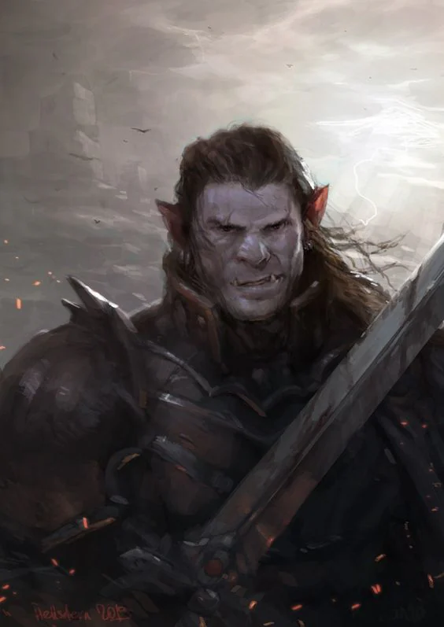
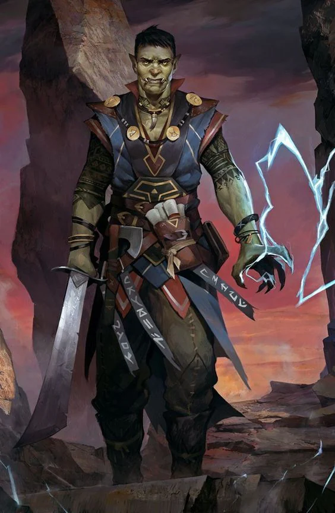
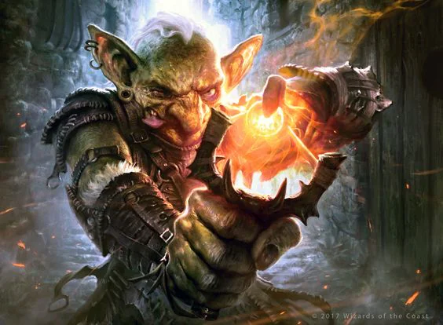

Driven off of their lands by an unknown enemy, they seem to have settled within the borders of the [[settings/Aylbyia/Factions/Queendom|Queendom]] and the newfound lands of the [[settings/Aylbyia/Society/Ancestries/Hill|Hill]] [[settings/Aylbyia/Society/Ancestries/Dwarves|Dwarves]].
<!-- onenote-media:start -->
> [!onenote-hero]
> 

> [!onenote-gallery]
> 
>
> 
<!-- onenote-media:end -->

Their numbers are unknown but they are thought to be a community that is focused on utilitarian ethics: What you do is of use to the community, you serve the whole. Their tactics are ruthless.

They occupy the lower rungs of the reincarnation cycle due to their siding with the [[settings/Aylbyia/Cosmology/Celestials and Saints/Celestials/Betrayer|Betrayer]]. They are green, grey or red skinned with large tusks.

<!-- vault-enrichment:start -->
## Related

- [[settings/Aylbyia/Factions/index|Factions]]
- [[settings/Aylbyia/index|Aylbyia]]
- [[settings/Aylbyia/Factions/List of factions and organisations|List of factions]]
- [[settings/Aylbyia/Factions/The threat from the North|The threat from the North]]
- [[settings/Aylbyia/History/Founding myth|Founding myth]]
- [[settings/Aylbyia/Regions/The Realm of Vuuch|The Realm of Vuuch]]
- [[settings/Aylbyia/Timeline|Timeline]]
- [[settings/Aylbyia/Factions/Queendom|Queendom]]
<!-- vault-enrichment:end -->
