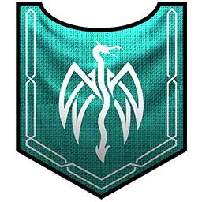
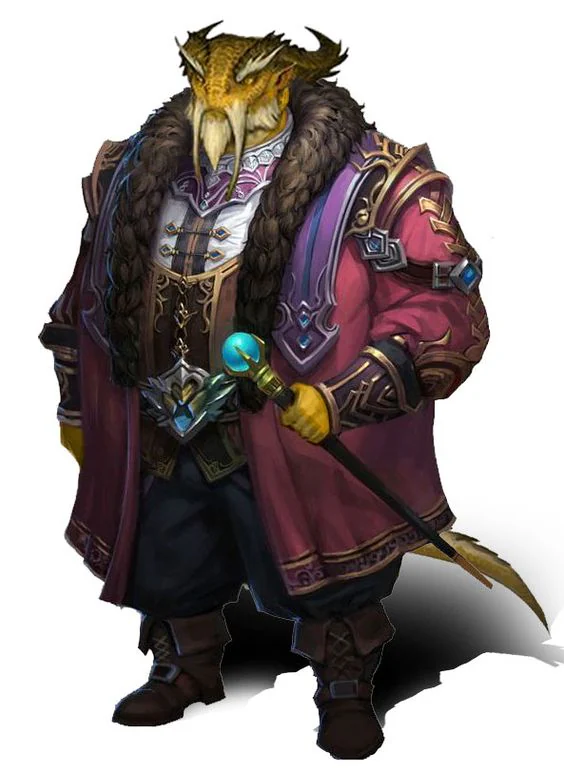
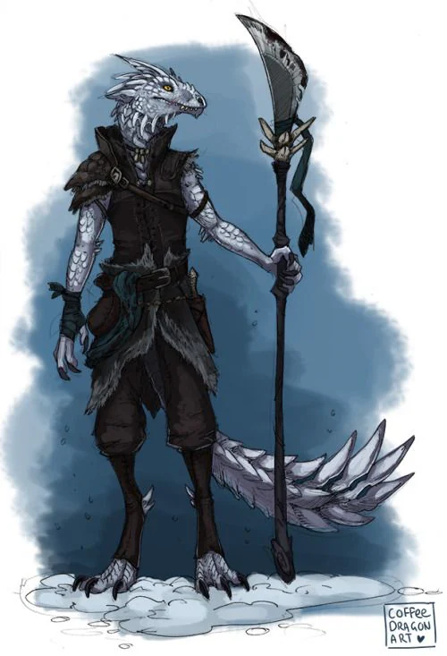

Although it is a recognized organization with which trade is possible, they pose a problem to the Churches in that their heretical beliefs might entice people into joining them. They follow a different belief system but it is not well understood.
<!-- onenote-media:start -->
> [!onenote-hero]
> 

> [!onenote-gallery]
> 
>
> 
<!-- onenote-media:end -->

Mark: white dragon on teal field

Honored reputation: ??

Shadow reputation: Worshippers of fasle idols

Gain reputation by:

- ??

Little is known of these people except that they have [rejected the worship](Worship%20of%20the%20Scaled%20Ones.md) of the [[Celestials]]. They mostly trade [[Redsteel]] which can only be bought there.
