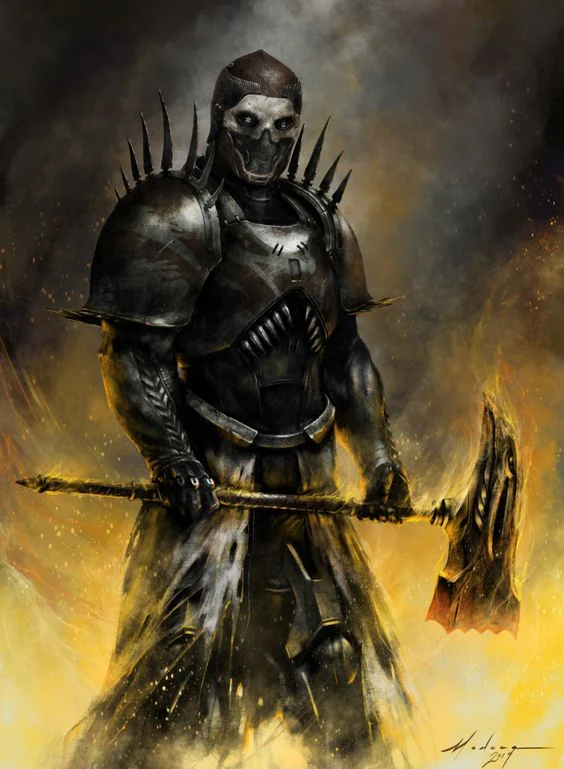
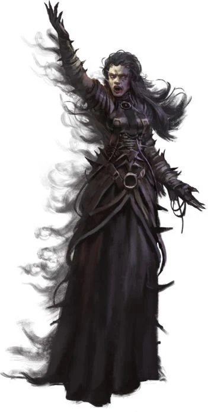

Shame made Flesh:
Creatures of the [[Twilight]]. Twisted beings that are said to be manifestations of our sins by the Church. They are vile tempting creatures that are there to test your strength of will and faith in the [[Celestials]].
<!-- onenote-media:start -->
> [!onenote-hero]
> 

> [!onenote-gallery]
> 
<!-- onenote-media:end -->

They sometimes take over communities and garner followers of the [[Twilight]]. You are to inform the Church immediately when encountering such individuals. The Church will deal with them and ensure that you have not been tainted.

<!-- vault-enrichment:start -->
## Related

- [[settings/Aylbyia/index|Aylbyia]]
- [[settings/Aylbyia/Factions/List of factions and organisations|List of factions]]
- [[settings/Aylbyia/Regions/Twilight|Twilight]]
- [[settings/Aylbyia/Cosmology/Celestials and Saints/Celestials/Celestials|Celestials]]
<!-- vault-enrichment:end -->
