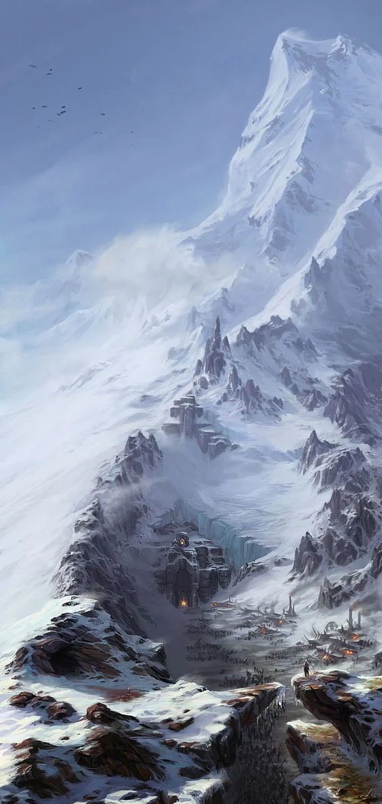

Honored Nature: Stoic
<!-- onenote-media:start -->
> [!onenote-hero]
> 

> [!onenote-gallery]
> 
<!-- onenote-media:end -->

Shadow Nature: Mysterious

Capital: Palace of the Sky Kings

Leader: Queen Rodne, The Stone Messiah

Art: ??

War: ??

Commerce: Trading through the [[Crystalsmith]] and contracting of people to gather materials for them.

Politics: The "Decadent" have been driven out of their territory. They are thought to be rebuilding and have closed themselves off to the outside.

Shadow activities: ??

NPCs: ??
