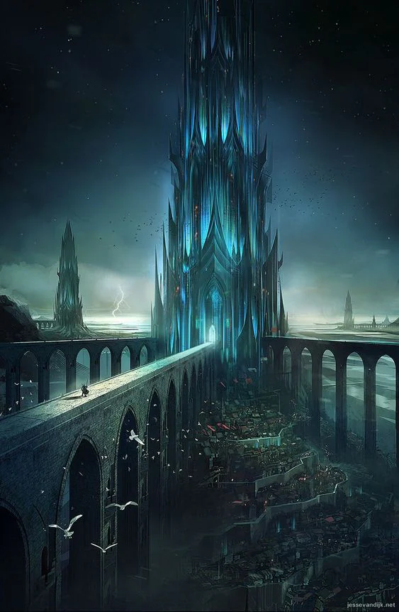
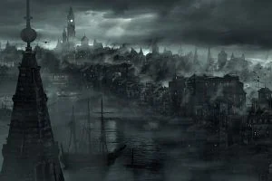
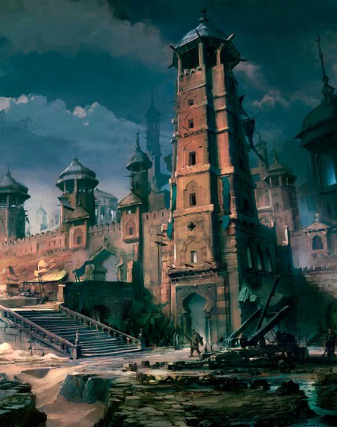

This faction is made up of several baronies
<!-- onenote-media:start -->
> [!onenote-hero]
> 

> [!onenote-gallery]
> 
>
> 
>
> 
>
> 
>
> 
<!-- onenote-media:end -->

Honored Nature: Wisdom

Shadow Nature: Aloofness

"Capital": [[The House of Water]]

Barony leaders:

- Overstar: [[Helena Filiva]]
- Coral: [[Jocelyn Ria]]
- Water: [[Naruun Nierdil Ferop Dagusta XII]]
- Sinder: [[Fergus Ironglove]]

War: Excel in guerilla tactics and control of their environment. Unpredictable and autonomous units.

Commerce: Heavy trade of produce of the land and wines.

Politics: Exists in a constant political turmoil and backstab
bing state.

Shadow activities: Assassinations!!!!!!! So many!!!!! Piracy and money laundering opportunities.

All baronesses make a pilgrimmage to [[Junon, The Celestial City]] to receive their blessing once a year. They would live to a long ripe age of 200 if not for the constant poisoning and assassination. The Baronnies are thought to now be under the effective control of [[The Coin]].
