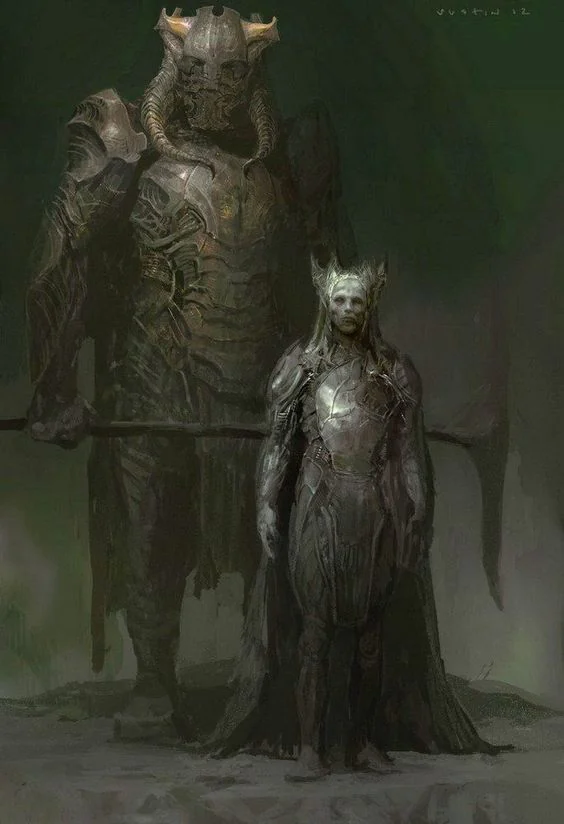

They have displaced the [[Orcs and Goblinoids]] from their steppes. They are formidable in great number. This threat is even greater.
<!-- onenote-media:start -->
> [!onenote-hero]
> 

> [!onenote-gallery]
> 
<!-- onenote-media:end -->

<!-- vault-enrichment:start -->
## Related

- [[settings/Aylbyia/index|Aylbyia]]
- [[settings/Aylbyia/Factions/List of factions and organisations|List of factions]]
- [[settings/Aylbyia/Factions/Orcs and Goblinoids|Orcs and Goblinoids]]
<!-- vault-enrichment:end -->
