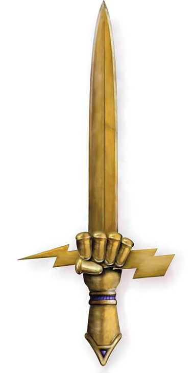

Mark: a blade with a hilt clutching a lightning bolt
<!-- onenote-media:start -->
> [!onenote-hero]
> 
<!-- onenote-media:end -->

Honored reputation: Will accomplish a task no matter what

Shadow reputation: Will accomplish a task if the pay is right

Gain reputation by:

- Helping a member accomplish their contract
- Give any form of shelter for one of their member
- Enter a contract with them and follow through with the pay

This is a renowned group of mercenaries. Aside from the standing armies of the [[settings/Aylbyia/Factions/Kingdom|Kingdom]] and the [[settings/Aylbyia/Organizations/Golden Mask|Golden Mask]] in the [[settings/Aylbyia/Factions/Queendom|Queendom]], they are the next largest military force of the continent. They have several chapters across the land and they are called to muster the castles at the edge of the [[settings/Aylbyia/Regions/Twilight|Twilight]] or around [[settings/Aylbyia/Regions/Fin's End|Fin's End]] usually. This mercenary group has its numbers greatly diminished due to their advances into [[settings/Aylbyia/Regions/Twilight|Twilight]] and the War of the Four Houses. They are looking to replenish their numbers.

This mercenary company is split in several chapters : The Hammerheads, The Red Company, Conclave of Wardens, Dead Men, Knightly Orders … These chapters each have a specialty and are preferred for certain tasks. Sometimes the chapters will be on opposing ends of a conflict. This is resolved either by negotiation, paying off the other chapter, combat between champions or all out battle.

<!-- vault-enrichment:start -->
## Related

- [[settings/Aylbyia/Organizations/index|Organizations]]
- [[settings/Aylbyia/index|Aylbyia]]
- [[settings/Aylbyia/Factions/List of factions and organisations|List of factions]]
- [[settings/Aylbyia/Timeline|Timeline]]
- [[settings/Aylbyia/Factions/Kingdom|Kingdom]]
- [[settings/Aylbyia/Organizations/Golden Mask|Golden Mask]]
- [[settings/Aylbyia/Factions/Queendom|Queendom]]
- [[settings/Aylbyia/Regions/Twilight|Twilight]]
<!-- vault-enrichment:end -->
