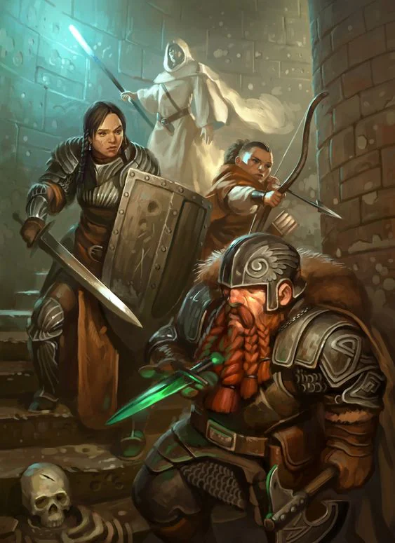
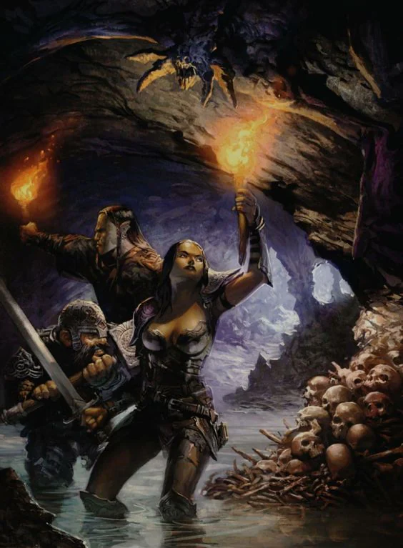

Mark: A pickaxe in a lamp
<!-- onenote-media:start -->
> [!onenote-hero]
> 

> [!onenote-gallery]
> 
<!-- onenote-media:end -->

Honored reputation: Eager explorators

Shadow reputation: Bite more than they can chew

Gain reputation by:

- Uncovering ruins
- Handing them maps of undiscovered places
- Accomplishing missions for them
- Bringing them ancient relics or knowledge

<!-- vault-enrichment:start -->
## Related

- [[settings/Aylbyia/index|Aylbyia]]
- [[settings/Aylbyia/Factions/List of factions and organisations|List of factions]]
- [[settings/Aylbyia/Timeline|Timeline]]
<!-- vault-enrichment:end -->
