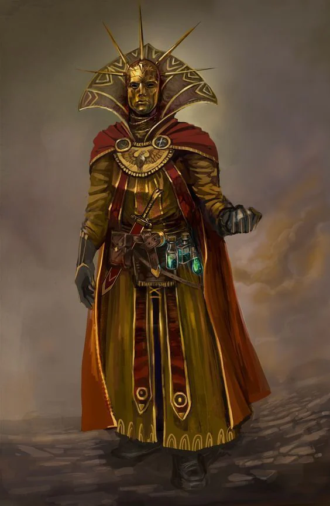

Mark: A golden Mask
<!-- onenote-media:start -->
> [!onenote-hero]
> 

> [!onenote-gallery]
> 
<!-- onenote-media:end -->

Honored reputation: Defenders of the realms

Shadow reputation: Overzealous

Gain reputation by:

- Behaving according to good church doctrine
- Donating to the church
- Accomplishing a mission for them

This is a holy order of knights, paladins and clerics devoted to the protection of the church and the realms. They pose themselves as facilitators for the action of the [[Celestials]] on the [[Plane of Flesh]]. Their most recent crusade is against the people rising up in Faindale. The uprising is to be crushed and the lands safely kept within the confines of the [[Queendom]] and the influence of the [[Church of the Flame]].

Their ranks run the gambit from soldier to emissary of the [[Celestials]]

<!-- vault-enrichment:start -->
## Related

- [[settings/Aylbyia/index|Aylbyia]]
- [[settings/Aylbyia/Factions/List of factions and organisations|List of factions]]
- [[settings/Aylbyia/Organizations/Band of Blades|Band of Blades]]
- [[settings/Aylbyia/Timeline|Timeline]]
- [[settings/Aylbyia/Cosmology/Celestials and Saints/Celestials/Celestials|Celestials]]
- [[settings/Aylbyia/Cosmology/The Planes/Plane of Flesh|Plane of Flesh]]
- [[settings/Aylbyia/Factions/Queendom|Queendom]]
- [[settings/Aylbyia/Factions/Churches/Church of the Flame|Church of the Flame]]
<!-- vault-enrichment:end -->
