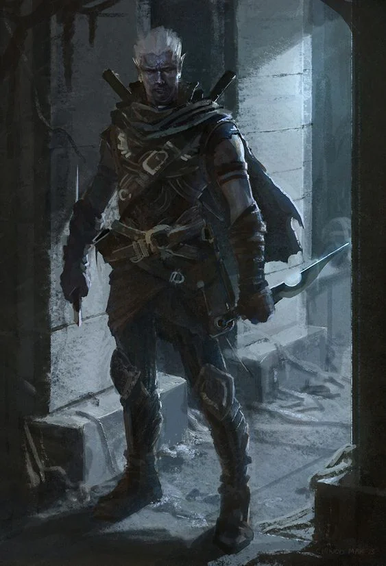
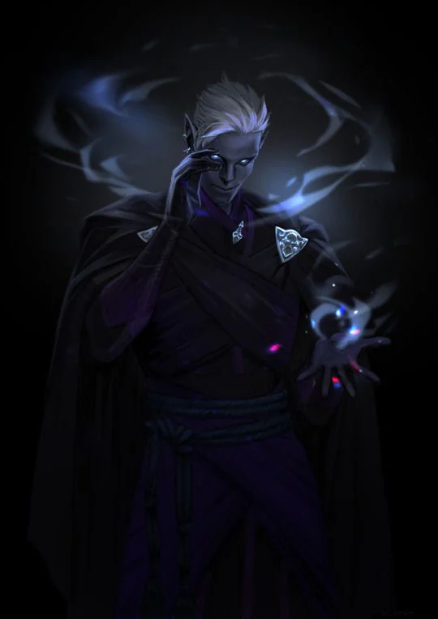

Mark: ??
<!-- onenote-media:start -->
> [!onenote-hero]
> 

> [!onenote-gallery]
> 
<!-- onenote-media:end -->

Honored reputation: NOPE!

Shadow reputation: Cold blooded killers

These are a group of people groomed to become assassins and thieves. All work is done as single person assassin unit. They are contacted and paid through chapters that exist in major city and the contract is then sent to an unknown assassin. They are trained in Frostmoot.

Something terrible has happened there and the various chapters have trouble keeping up the appearances of a unified organization. Some of them now operate in groups outside of the organization or have decided to hang up on their handlers. How will these new loose canons fit in society?

<!-- vault-enrichment:start -->
## Related

- [[settings/Aylbyia/Organizations/index|Organizations]]
- [[settings/Aylbyia/index|Aylbyia]]
- [[settings/Aylbyia/Factions/List of factions and organisations|List of factions]]
- [[settings/Aylbyia/Regions/great houses of humanity/Sinderealms|Sinderealms]]
- [[settings/Aylbyia/Regions/great houses of humanity/The Great Houses of Humanity|The Great Houses of Humanity]]
- [[settings/Aylbyia/Society/Ancestries/Elves|Elves]]
- [[settings/Aylbyia/Timeline|Timeline]]
<!-- vault-enrichment:end -->
