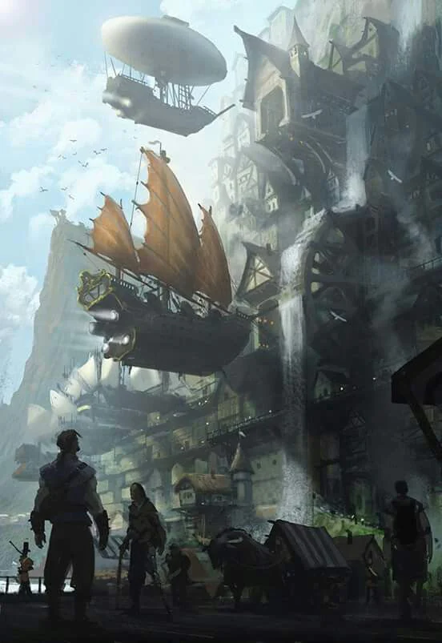

Mark: A sparrow
<!-- onenote-media:start -->
> [!onenote-hero]
> 

> [!onenote-gallery]
> 
<!-- onenote-media:end -->

Honored reputation: Diligent Merchants

Shadow reputation: Abusing their monopoly

Gain reputation by:

- Promoting their airships
- Protecting a merchant of the Company
- Completing missions for the Company
- Keeping the secrets of the Company within knowing people
- Trading [[settings/Aylbyia/Society/Silksteel|Silksteel]] with them

This is the enterprise that has come up with the design for airships. They keep the secrets of its fabrication to themselves. They are composed mostly of tinkerers and woodworkers. The seat of the organization is located in [[settings/Aylbyia/Settlements/Junon, The Celestial City|Junon, The Celestial City]] and has another branch in the Hallowroost. They are made up of gnomes and halflings mostly.

<!-- vault-enrichment:start -->
## Related

- [[settings/Aylbyia/Organizations/index|Organizations]]
- [[settings/Aylbyia/index|Aylbyia]]
- [[settings/Aylbyia/Factions/List of factions and organisations|List of factions]]
- [[settings/Aylbyia/Organizations/The Coin|The Coin]]
- [[settings/Aylbyia/Society/Silksteel|Silksteel]]
- [[settings/Aylbyia/Timeline|Timeline]]
- [[settings/Aylbyia/Settlements/Junon, The Celestial City|Junon, The Celestial City]]
<!-- vault-enrichment:end -->
