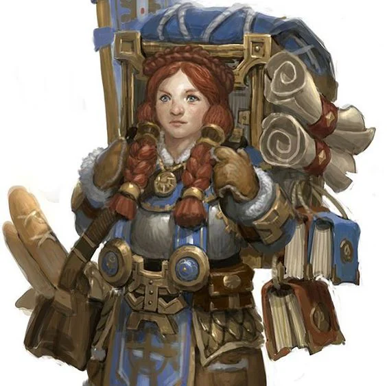
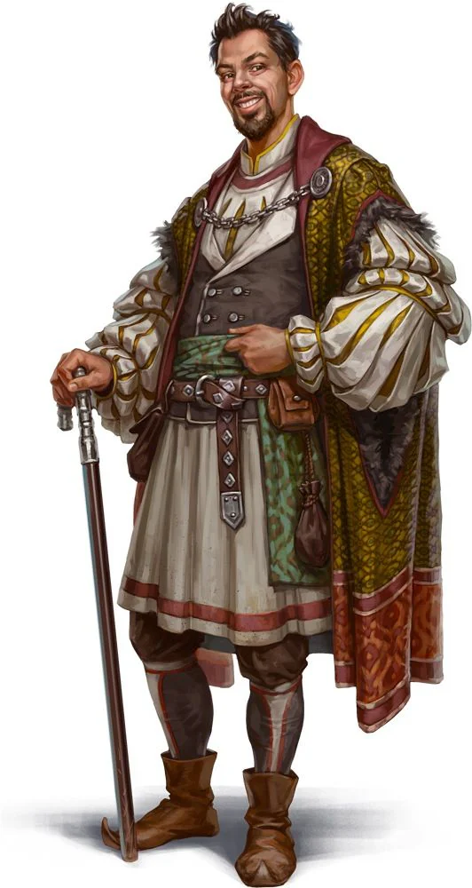

Mark: A golden coin
<!-- onenote-media:start -->
> [!onenote-hero]
> 

> [!onenote-gallery]
> 
<!-- onenote-media:end -->

Honored reputation: Respect contracts

Shadow reputation: Driving a mean deal

Gain reputation by:

- Trading with them
- Accomplishing tasks for them
- Protecting their members

This is the trading guild that was established long before [[Sparrow Trading Company ]](STC) came into play. They are now suffering due to their supply routes being undermined by  the STC. They are reputed for opening up shops and welcoming new businesses within their ranks. They serve both as a bank and trading organization. They have aggressively pursued the expansion of their influence in the baronnies.
