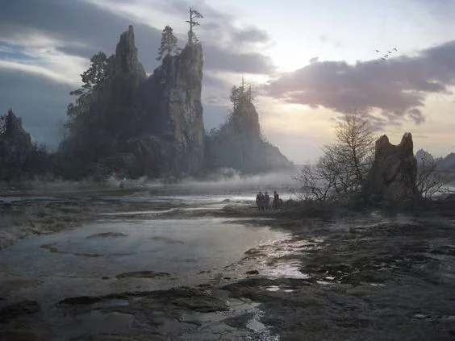
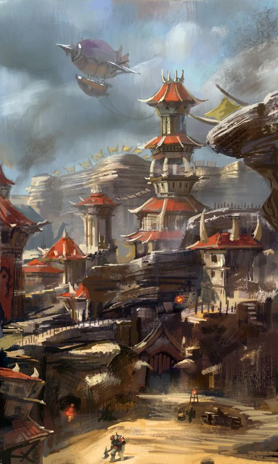

- Most important city: [[Lor]], The First City
- [[Unarchus]]
<!-- onenote-media:start -->
> [!onenote-hero]
> 

> [!onenote-gallery]
> 
<!-- onenote-media:end -->

This area is lost to the world. Expeditions into these lands have been infructuous. Nobody has come back. Thus some have named this region : The Deadlands

Region Flavor: Untamed land except for a select few cities, the whole region has gone dead silent.

Geography: Tall grasslands, dry with bouts of heavy rainfall. Currently under a persistent giant unmoving dark cloud.

Clothing: Tall boots that prevent snakebites, the orcs seen wear gear that is very practical for rapid movement and riding. Deep baryton tunes and bass rythmic and repetitive sounds.

Art: Paintings using earthy colors. They always depict intricate geometric shapes. The technique for producing these paintings is not understood.

Food: Lots of game and spices cooked on open flame. Fermented fruit juice is the safest source of water other than river water.

Lifestyle: Unknown

<!-- vault-enrichment:start -->
## Related

- [[settings/Aylbyia/index|Aylbyia]]
- [[settings/Aylbyia/Regions/The Platsmoor|The Platsmoor]]
- [[settings/Aylbyia/Timeline|Timeline]]
- [[settings/Aylbyia/Settlements/Orkunsteppes/Lor|Lor]]
- [[settings/Aylbyia/Settlements/Orkunsteppes/Unarchus|Unarchus]]
<!-- vault-enrichment:end -->
