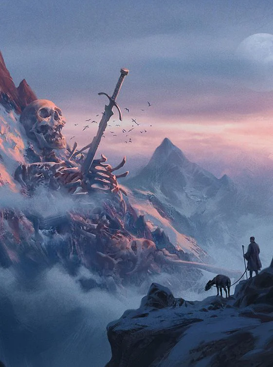

Inhabited by the [[settings/Aylbyia/Society/Ancestries/Mountain|Mountain]] [[settings/Aylbyia/Society/Ancestries/Dwarves|dwarves]]. The only point of access is through the Palace of the Sky Kings. The intricate sculpting architecture makes no sense for outsiders and seems to change every time you get there by airship (on invitation only).
<!-- onenote-media:start -->
> [!onenote-hero]
> 
<!-- onenote-media:end -->

Important locations

- [[settings/Aylbyia/Settlements/Tower of a Thousand Stars|Tower of a Thousand Stars]]: Location of the Crystal Smiths Guild Headquarters. These dwarves built an immense crystal tower that shines light akin to a starry sky on the mountains nearby at night.

- Hall of [[settings/Aylbyia/Cosmology/Celestials and Saints/Saints/Andvar|Andvar]]: Hall of worship of Saint [[settings/Aylbyia/Cosmology/Celestials and Saints/Saints/Andvar|Andvar]]. Sober building of worship with no roof. Worshippers come here to show their resilience. Prime place of training of all paladins of the church.

- Faindale: Location of the violent repression that is taking place. The only location that grants access to the [[settings/Aylbyia/Settlements/Tower of a Thousand Stars|Tower of a Thousand Stars]].

<!-- vault-enrichment:start -->
## Related

- [[settings/Aylbyia/Regions/index|Regions]]
- [[settings/Aylbyia/index|Aylbyia]]
- [[settings/Aylbyia/Maps/index|Maps]]
- [[settings/Aylbyia/Regions/Regions of the world|Regions of the world]]
- [[settings/Aylbyia/Society/Ancestries/Mountain|Mountain]]
- [[settings/Aylbyia/Society/Ancestries/Dwarves|Dwarves]]
- [[settings/Aylbyia/Settlements/Tower of a Thousand Stars|Tower of a Thousand Stars]]
- [[settings/Aylbyia/Cosmology/Celestials and Saints/Saints/Andvar|Andvar]]
<!-- vault-enrichment:end -->
