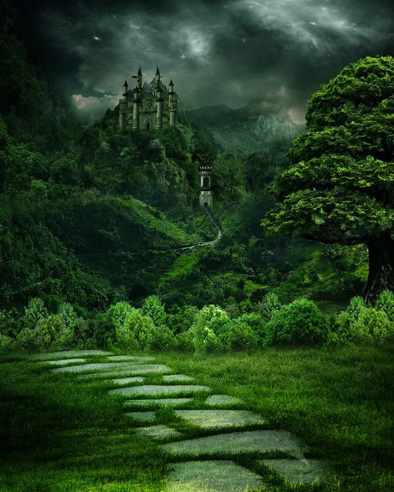
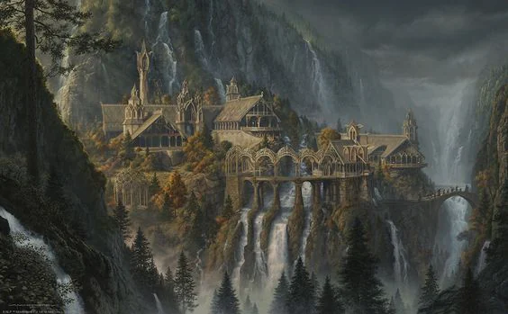

Most important city: [[settings/Aylbyia/Settlements/Ziebglen|Ziebglen]], Seat of [[settings/Aylbyia/Cosmology/Celestials and Saints/Saints/Aumogonne|Aumogonne]]
<!-- onenote-media:start -->
> [!onenote-hero]
> 

> [!onenote-gallery]
> 
<!-- onenote-media:end -->

Region Flavor

Geography: Plains with verdant agricultural fields.

Clothing: Bright colored clothing with heavy uses of feathers in headwear.

Art: Strong written tradition, with calligraphy. The preferred means of artistic expression is through poems.

Food: Wheat based food and green vegetable stews and casseroles. Chicken and fowl are the most common meats otherwise replaced by sour beans for those who ascribe to vegetarian or vegan diets.

Lifestyle: Strong military and seafaring tradition that is being threatened by the arrival of airships.

Important locations
- Klett: Border castle to the [[settings/Aylbyia/Regions/Orkunsteppes|Orkunsteppes]].

- [[settings/Aylbyia/Regions/Map Features/Pale Gate|Pale Gate]]: Military shipyard used to control the bay.

- Tavik Dejonder: Location of a ruin with a circle of teleportation. It is a town built upon the ruins of the ancient city.

- Tavik Dwallur: Location of a ruin with a circle of teleportation. Contentious location that gives some power to the people who control this important access point.

- Freeriver: Autonomous city that controls trade access towards the sea.

- Passabel: Port city that is competing with Kingsport in terms of ship building.

- Kingsport: Port city that is looking to use the wood from the eldergrove to get the upperhand on the competition with Passabel.

- Eltegrove: Grove of pilgrimage for druids. It has significance in the belief that night gives way to day thanks to their ritual.

- Kynslia: Small village of druids who keep the grove and surrounding forest.

- Lesidia: Small mining village, sending their ore to Breytowne.

- Breytowne: Port city focused on shipping goods to the [[settings/Aylbyia/Regions/great houses of humanity/The Great Houses of Humanity|barronies]].

<!-- vault-enrichment:start -->
## Related

- [[settings/Aylbyia/Regions/index|Regions]]
- [[settings/Aylbyia/index|Aylbyia]]
- [[settings/Aylbyia/Factions/Churches/Church of Light|Church of Light]]
- [[settings/Aylbyia/Factions/Kingdom|Kingdom]]
- [[settings/Aylbyia/Maps/index|Maps]]
- [[settings/Aylbyia/NPCs/kingdom/Johan de Meyer|Johan de Meyer]]
- [[settings/Aylbyia/Regions/Map Features/Haerone Forest|Haerone Forest]]
- [[settings/Aylbyia/Regions/Map Features/Lake Koral|Lake Koral]]
<!-- vault-enrichment:end -->
