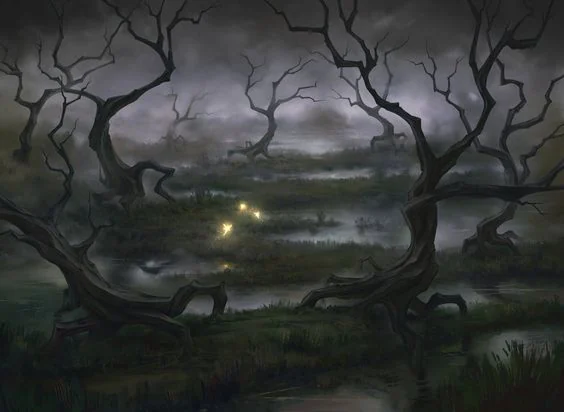
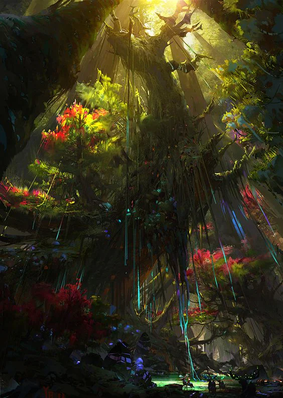

Most important city: [[Tavik Nurlowk]]
<!-- onenote-media:start -->
> [!onenote-hero]
> 

> [!onenote-gallery]
> 
<!-- onenote-media:end -->

Region Flavor: Dangerous place where nature has retaken its hold over. Old ruins are covered by vegetation and wild animals are rampant. Small communities of treasure seekers roam the land if they are brave enough. Others come here to study the vegetation and go to the Unspoiled Garden to get samples for their work.

Geography: Tall grassland, very humid, almost no wind. Swamplands closer to the Cobalt Bay.

Clothing: Covering oneself to prevent insects from biting is paramount. Those living in the wilds will wear clothes that cling tighter to themselves while traveling while preferring looser clothing when resting. People's heads are usually covered in protective veil. The colors vary, bright when traveling to scare away predators, green and brown when hunting.

Art: temporary artistic sculptures made of vines and other plant materials. The longer lasting ones are those made by hunters who sculpt small statues made of bones. Music is played in the form of whistles and various rapid percussion instruments.

Food: Lots of fruit dishes as well as fungus and various roots.

Lifestyle: The denizens of this area are few and they mostly stick to their town or camp. Some sometimes travel to uncover treasure or do research. Since the fall of Tavik, trade through Pelcov has dwindled.

Important locations

- Pelcov: Small town that was the preferred stop for traders and supply lines to [[Tavik Nurlowk]]. Now inhabited by veterans of [[Tavik Nurlowk]], the town sees little trade and is under pressure of the newly arrived [[Orcs and Goblinoids]] warbands. Where are they? Why haven't they come yet? Are they preparing something?

- Cave of the Sun: A monastery dedicated to the worship of the sun. It is secluded and its members mostly stick to their temple. Some are seen at times in Pelcov to exchange medicinal services for supplies that they bring back. They speak little. Some stop here before journeying to the Unspoiled Garden

- The Unspoiled Garden: A pristine forest that is unexplored. While the edge of the forest are documented and known, the inner parts of the forest have never been threaded. Those who venture in never come out.
