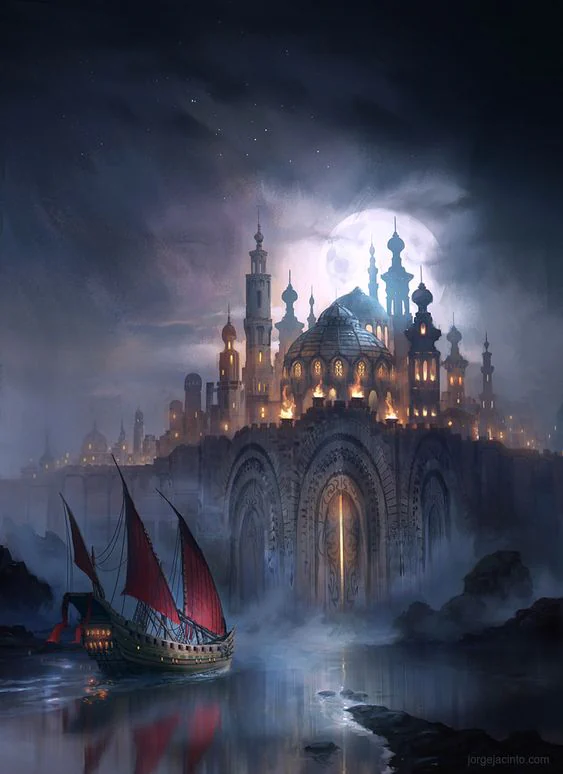
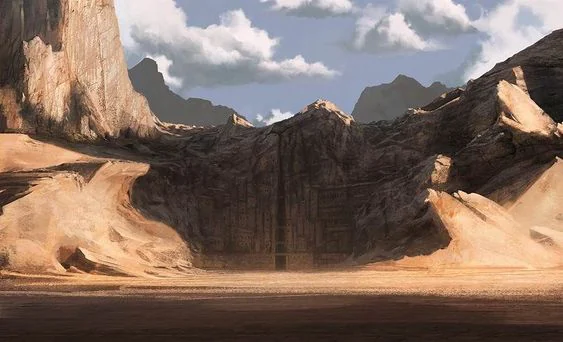

Most important city: [[settings/Aylbyia/Settlements/Junon, The Celestial City|Junon, The Celestial City]]
<!-- onenote-media:start -->
> [!onenote-hero]
> 

> [!onenote-gallery]
> 
>
> 
<!-- onenote-media:end -->

Important locations

- Sola Mira: Large city near an oasis. The water of this oasis is refined and used by alchemists for medicinal purposes.

- The Wager: Castle and town controlling the passage from the desert to the rest of the world. It is a military stronghold.

- Caslte Baghid: Southern point of control towards [[settings/Aylbyia/Factions/The Great Houses of Humanity|The Great Houses of Humanity]] and a lookout towards [[settings/Aylbyia/Regions/Fin's End|Fin's End]]

- Blacksand Keep: Fortress built to sustain a siege from the evils that might sprout from the [[settings/Aylbyia/Regions/Twilight|Twilight]].

- Hallowroost: Dangerous location of Griffon rearing and secondary location for airship construction.

- The Savage Dunes: Nomad occupied lands where sand lizards are hunted for their gems that can fuel magic spells.

- Hivespines: Mountains that contain a lot of Dire creatures.

Region Flavor: Harsh and unforgiving desert, under the watchful eye of the Sun, window onto our world from the [[settings/Aylbyia/Cosmology/The Planes/Heavens|Heavens]].

Geography: Large sand dune desert. Permanent locales are found in cooler places or near places with access to water nearby.

Clothing: Either very dark or completely white clothing, made of thin fabrics. Faces are covered in veils when traveling through the desert to protect from the sun, dust and heat.

Art: Depiction of the visions that the people of the clergy have seen. Statues attempting to capture concepts taught by the church. Wind instruments are used to accompany church hymns.

Food: Food comes from all over the continent to merge in this place for who has the money to afford it. However one spice can only be found in this large desert. It is harvested from certain rocks under sand on which some animals have died and dried away. This spice is extremely bitter and called Suif. It is put on flat bread. Tea is also a very popular beverage in this region.

Lifestyle: Life is largely organized by and through the church. People rely on the trade with the outside world for their livelihood. Nomads travel by camel or lizards. Most activities take place during the evening or early in the morning to avoid the heat.

<!-- vault-enrichment:start -->
## Related

- [[settings/Aylbyia/Regions/index|Regions]]
- [[settings/Aylbyia/index|Aylbyia]]
- [[settings/Aylbyia/Maps/index|Maps]]
- [[settings/Aylbyia/Regions/Map Features/Bay of Peril|Bay of Peril]]
- [[settings/Aylbyia/Regions/Regions of the world|Regions of the world]]
- [[settings/Aylbyia/Settlements/Junon, The Celestial City|Junon, The Celestial City]]
- [[settings/Aylbyia/Factions/The Great Houses of Humanity|The Great Houses of Humanity]]
- [[settings/Aylbyia/Regions/Fin's End|Fin's End]]
<!-- vault-enrichment:end -->
