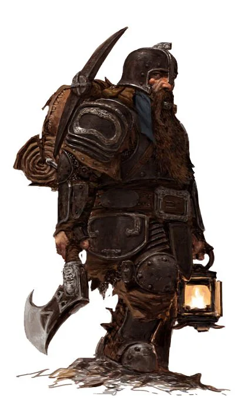
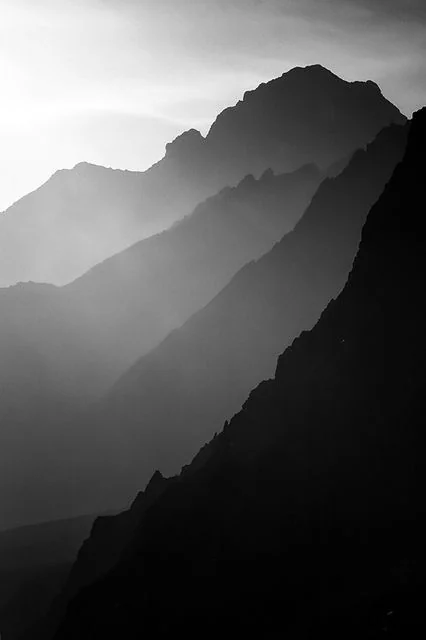
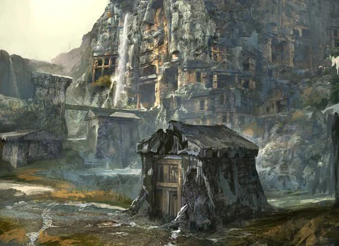

Smaller and older mountains than the Older Brother, the [[Hill]] dwarves came tumbling down some 300 years ago from them and established towns and cities within the valley east of these mountains.
<!-- onenote-media:start -->
> [!onenote-hero]
> 

> [!onenote-gallery]
> 
>
> 
<!-- onenote-media:end -->

- Castle Filoria: [[Hill]] dwarf stronghold, it sees trade and is said to contain large amounts of gold a valuables

- Koral City: City built from the blue stones harvested from the mountains that lie to the east of it.

- Farshore: City now lost to the Orc horde.

- Haerone Forest: Forest with a lot of game that has now since been overtaken by the Orcs.

- Bugundhelm: Rich city that thrives on the extraction of precious stones that can be found flowing from the river.

- Hachenford: City that has faired poorly thanks to the arrival of mining dwarves upstream. They are in tension with their northern neighbours and have had to rely on trade tariffs for goods passing through to make do.

<!-- vault-enrichment:start -->
## Related

- [[settings/Aylbyia/index|Aylbyia]]
- [[settings/Aylbyia/Regions/Regions of the world|Regions of the world]]
- [[settings/Aylbyia/Society/Ancestries/Hill|Hill]]
<!-- vault-enrichment:end -->
