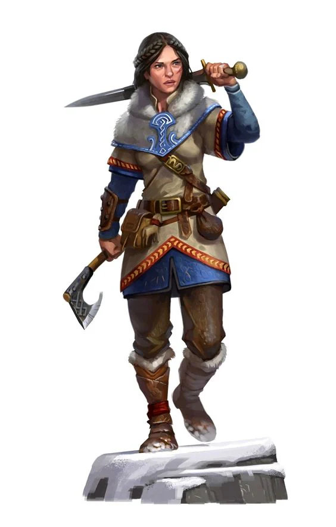
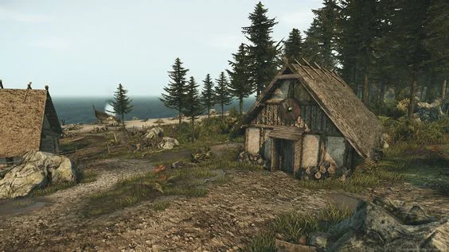

Most important city: [[Hatchaka]]
<!-- onenote-media:start -->
> [!onenote-hero]
> 

> [!onenote-gallery]
> 
<!-- onenote-media:end -->

Region Flavor: Hilly green region where civilization has not threaded yet. Fishing villages inhabited by proud people.

Geography: Forest and Plains that are cut through by sets of hills and mountains. Regular strong wind bursts throughout the land.

Clothing: Brown and green clothing for those who work the land and hunt, blue and white for those who  work at sea. They all wear clothing that cover against the wind in the form of a long hooded poncho-like cloak called the Tiulasa Windbreaker.

Art: Simlpe woodworked items and earthy colors.

Food: Lots of game, fish and roots cooked in stews.

Lifestyle: The people of this land live mostly isolated from the rest of the world. They fish, farm and hunt for their food. The dangerous animals that inhabit the plain usually prevent them from straying far from towns. They are people of few words.

- Mount Tiulasa: Impossibly tall and steep peak that erupted from the ground at a time forgotten from any living memory. It is a location of pilgrimmage for the devout who go there to meditate after braving the plains and the ascension of the peak.

- Bruluxus: Small fishing village that sometimes have brave young people head to Advena to seek fortune and adventure.

- Advena: Island that lies at the North-West of Tiulasa. It is chronicled that Ancient people lived on this Island before a cataclysm brought about the end of it.

- Antenium: A small village of hunters and carpenters. Their work is valued throughout the rest of the villages of the island.

- Jothim: Fishing village that enjoys the relative safety of fishing within the boundaries of its bay and trade with Bruluxus

- The Corrupted Tavik: Once the only mountain city of this island, Tavik has now fallen to a strange plague. Noone has threaded the road to Tavik in years and the dead fish in the bay of the Bitter Stream attest of the continuing hanging ominousness of the location.

<!-- vault-enrichment:start -->
## Related

- [[settings/Aylbyia/index|Aylbyia]]
- [[settings/Aylbyia/Regions/Regions of the world|Regions of the world]]
- [[settings/Aylbyia/Society/Silksteel|Silksteel]]
- [[settings/Aylbyia/Timeline|Timeline]]
- [[settings/Aylbyia/Settlements/Hatchaka|Hatchaka]]
<!-- vault-enrichment:end -->
