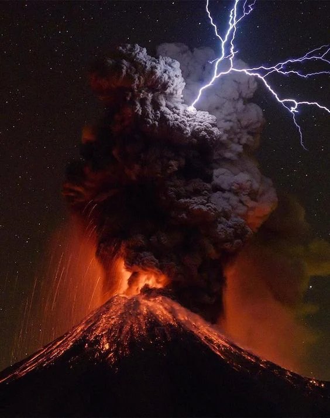
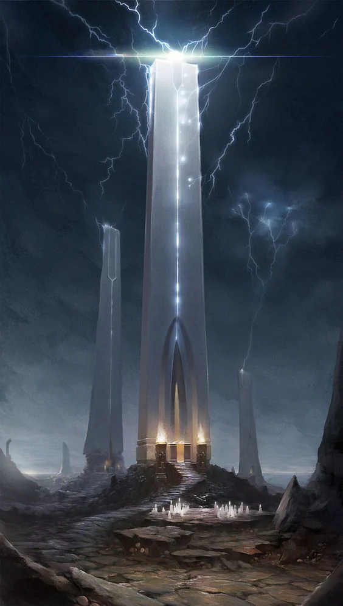

The area that was said to have been the final battlefield of the war waged against the [[Heavens]] by the [[Betrayer]]. It is an area from which nothing grows and that corrupts all those who live inside it. The people living at its border eventually turn into [[Tiefling|tieflings]].
<!-- onenote-media:start -->
> [!onenote-hero]
> 

> [!onenote-gallery]
> 
<!-- onenote-media:end -->

- The Unholy Sepulcher: Said to be the location of the tomb for the body of the being who [betrayed](Shaïdin.md) the [[Heavens]].

- The Hanging Tree: Rumored to be an enormous tree that floats above the ground, roots reaching towards the sky. From the branches hang innumerable humanoids.

- The Smoulderspine: Tall volcano that is said to the the place from which the spirit of the [[Betrayer]] was banished. Wounding the world and leaving the blight behind as a final spiteful action.

- Temple of Eternal Cinder: Temple of those who worshipped the [[Betrayer]], ancient great city of the Tavik Empire.
