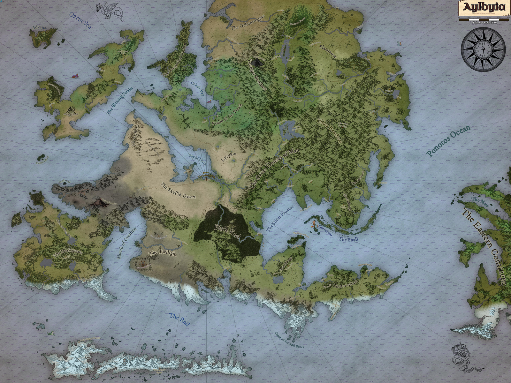

# Aylbyia
<!-- onenote-media:start -->
> [!onenote-hero]
> 
<!-- onenote-media:end -->

The world is a large and unstable place. The big movers and shakers of the world are going forward with their plots. The dwarves have split and are at each others' throats. The baronnies have fallen under the influence of the greedy. The Queendom is still reeling from the loss of most of the members of their royal bloodline. Wherever the elves come from must be bad, why are there so many of them coming out of the Great Forest? The land of the Orcs have gone silent. Refugees without a land, they strive to try and carve a space for themselves. The now named Deadlands harbour horrors that are waiting for the right time to spring.

Aylbiya is a rich world with many moving pieces. Here is a handy-dandy menu to navigate some of these things:

- [[List of factions and organisations]]
- [[The cosmos, gods and magic]]
- [[History of the world]]
- [[Regions of the world]]
- 
