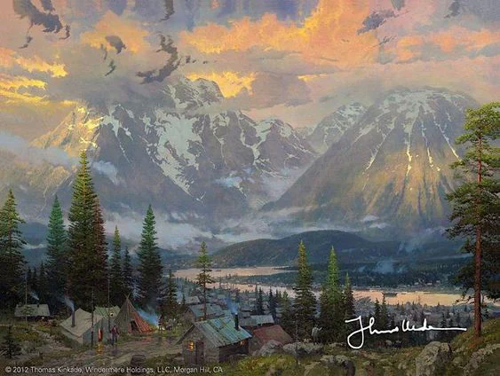
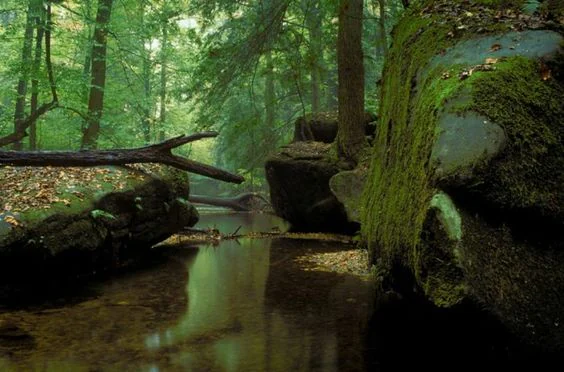
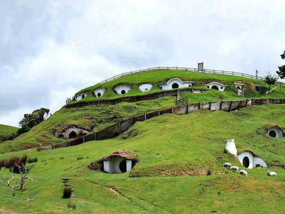

Working wood, forestry and hunting. Quiet people who tend to the land. They enjoyed relative safety from the Empire during the conflict and thrived economically during the conflict while the other nations sent troops.

<!-- onenote-media:start -->
> [!onenote-hero]
> 

> [!onenote-gallery]
> 
>
> 
<!-- onenote-media:end -->

