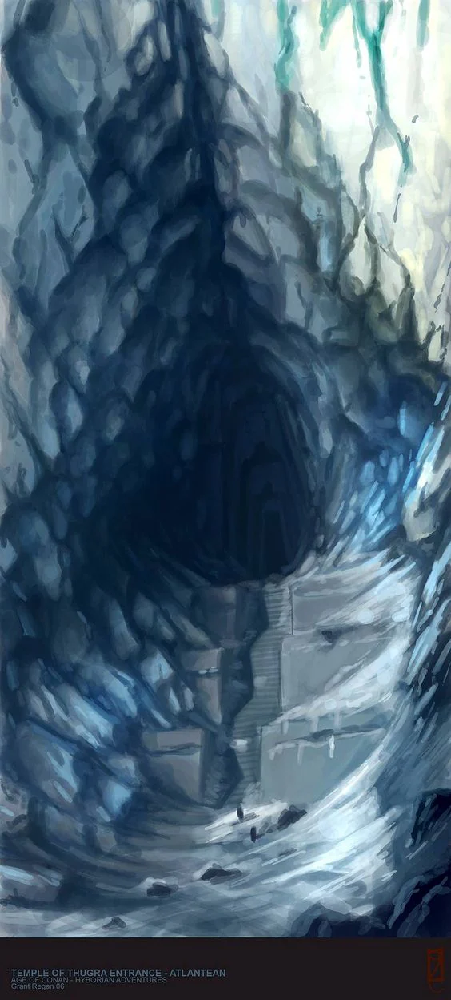
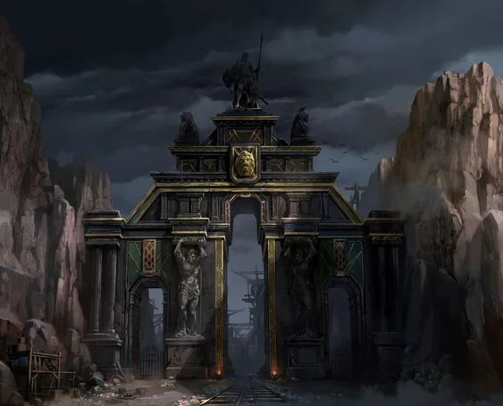
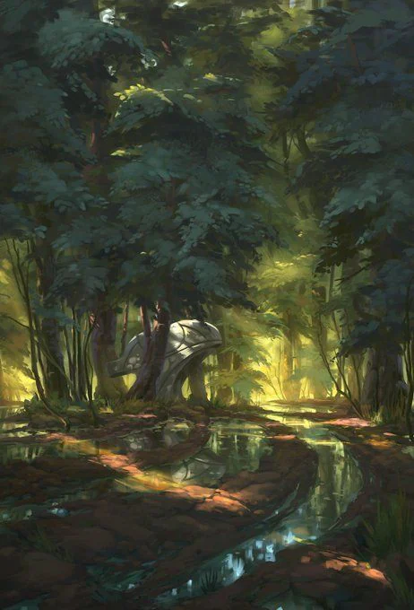

Only known entrance built to head into the Shadow Range. Some speculate to reach the ruins of Gomnigan, others say it is to reach some old treasure or tomb. Experts in seafaring, they provided much in terms of troops and boats during the conflict with the Empire.

<!-- onenote-media:start -->
> [!onenote-hero]
> 

> [!onenote-gallery]
> 
>
> 
<!-- onenote-media:end -->

