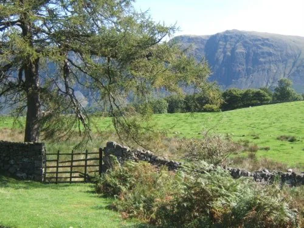
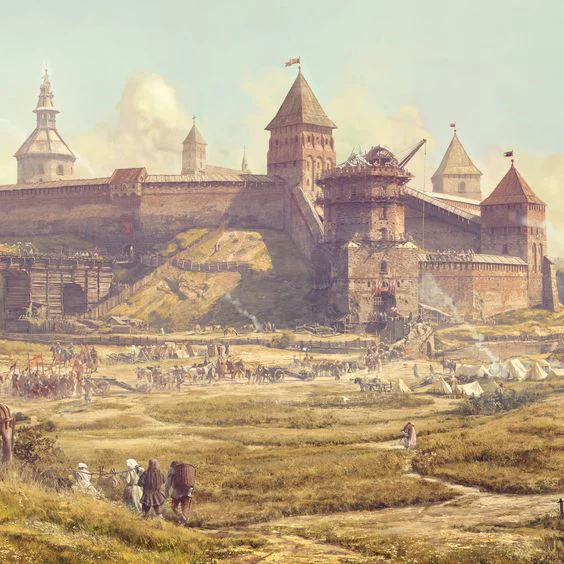

Grainery of the bay. On the forefront of the war, they sent many soldiers to fight. They are stubborn and honest folk who do not shy away from work while leading a simple life.

<!-- onenote-media:start -->
> [!onenote-hero]
> 

> [!onenote-gallery]
> 
>
> 
<!-- onenote-media:end -->

<!-- vault-enrichment:start -->
## Related

- [[settings/Middleworld/Factions/index|Middleworld — Factions]]
- [[settings/Middleworld/index|Introduction]]
- [[settings/Middleworld/Maps/index|Maps]]
<!-- vault-enrichment:end -->
