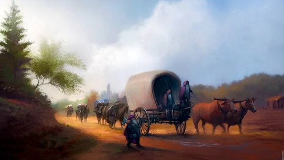
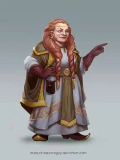
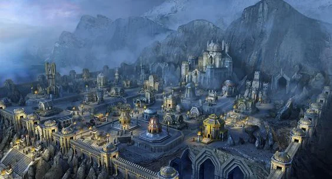
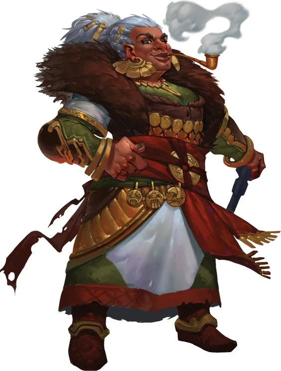
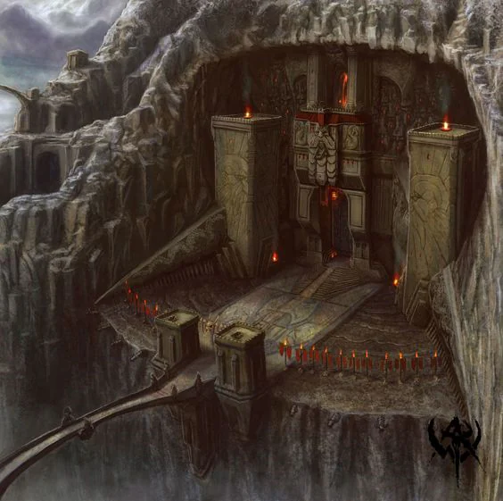

Old dwarven kingdom, extremely attached to traditions and boasts about being the rampart of the world against [[settings/Middleworld/Society/The Empire|the Empire]]. If you wish for something sturdy to be built and lots of them, these are the people to call. Heavy on mining and has access to exclusive resources.

<!-- onenote-media:start -->
> [!onenote-hero]
> 

> [!onenote-gallery]
> 
>
> 
>
> 
>
> 
<!-- onenote-media:end -->

The Voidlands are also ripe for refining or transforming certain ore.

<!-- vault-enrichment:start -->
## Related

- [[settings/Middleworld/Factions/index|Middleworld — Factions]]
- [[settings/Middleworld/index|Introduction]]
- [[settings/Middleworld/History/index|History]]
- [[settings/Middleworld/Maps/index|Maps]]
- [[settings/Middleworld/Organizations/Builder's guild|Builder's guild]]
- [[settings/Middleworld/Regions/Drauva|Drauva]]
- [[settings/Middleworld/Society/The Empire|The Empire]]
<!-- vault-enrichment:end -->
