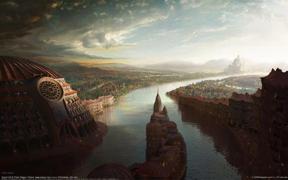

Group of mining cities that exploit the troubles in [[settings/Middleworld/Society/The Empire|the Empire]] to gather more resources. Looking to expand to the East. Boisterous, fiercely independent from each other. They will however come to the aid of their neighbour if they feel their lifetsyles may be in danger.

<!-- onenote-media:start -->
> [!onenote-hero]
> 

> [!onenote-gallery]
> 
<!-- onenote-media:end -->

<!-- vault-enrichment:start -->
## Related

- [[settings/Middleworld/Factions/index|Middleworld — Factions]]
- [[settings/Middleworld/index|Introduction]]
- [[settings/Middleworld/History/index|History]]
- [[settings/Middleworld/Maps/index|Maps]]
- [[settings/Middleworld/Society/The Empire|The Empire]]
<!-- vault-enrichment:end -->
