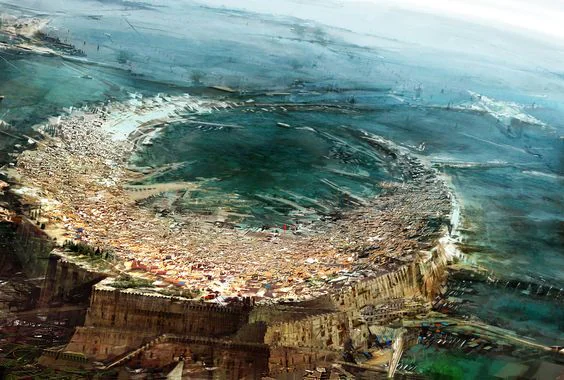
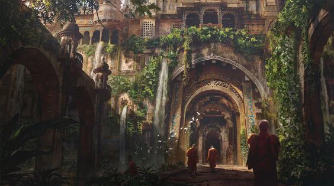
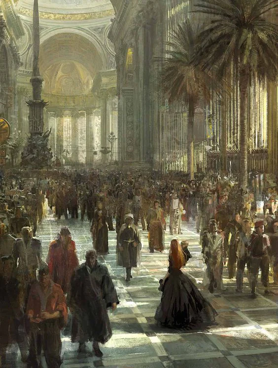

"Mediterranean" city with a large mana well

<!-- onenote-media:start -->
> [!onenote-hero]
> 

> [!onenote-gallery]
> 
>
> 
<!-- onenote-media:end -->

Huge port, very large cityscape that covers the entire island. All people mix in here. All is fair game in this city as long as you don't fall on the wrong side of the Guard and you don't cause trouble to the richer folks.

<!-- vault-enrichment:start -->
## Related

- [[settings/Middleworld/Factions/index|Middleworld — Factions]]
- [[settings/Middleworld/index|Introduction]]
- [[settings/Middleworld/Cosmology/Religion|Religion]]
- [[settings/Middleworld/History/index|History]]
- [[settings/Middleworld/Maps/index|Maps]]
- [[settings/Middleworld/Organizations/Builder's guild|Builder's guild]]
- [[settings/Middleworld/Society/Ancestries and language|Ancestries and language]]
<!-- vault-enrichment:end -->
