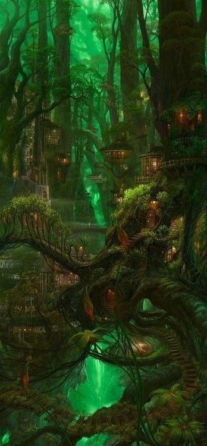
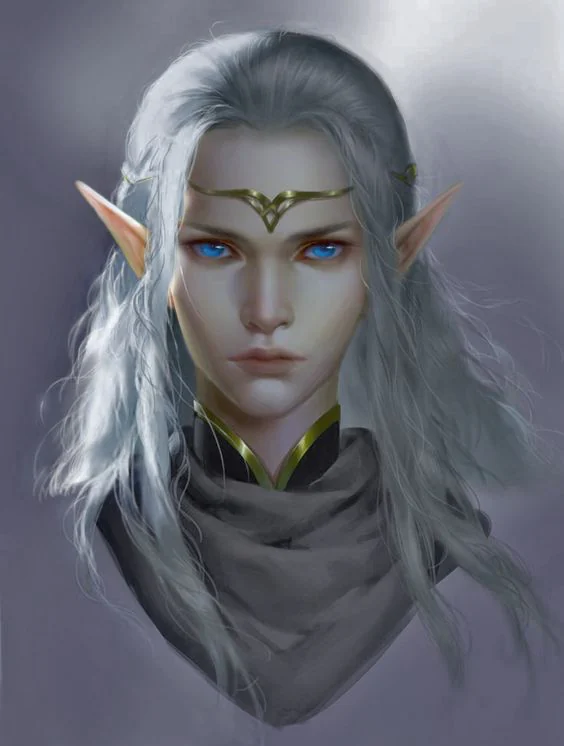
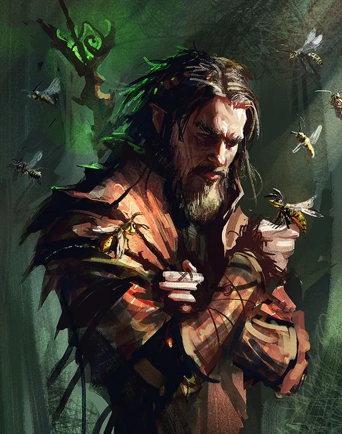

Attached to nature and traditions, golden trees grow above their manawells. They enjoy a mana-rich environement that may be the cause of their affinity for magic.

<!-- onenote-media:start -->
> [!onenote-hero]
> 

> [!onenote-gallery]
> 
>
> 
<!-- onenote-media:end -->

Separated for hundreds of years from their compatriotes in the Nevergreen forest and those that went to Meridios.
