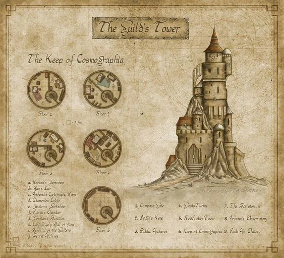
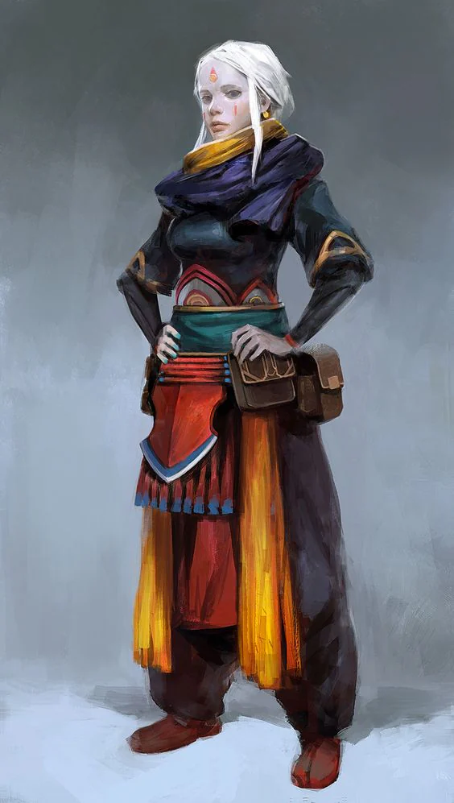

Established in [[settings/Middleworld/Factions/Gildain|Gildain]], moved to [[settings/Middleworld/Factions/Vallios|Vallios]], they have now undertaken a contract to try and save Tesagred from sinking into the surrounding marshes.

<!-- onenote-media:start -->
> [!onenote-hero]
> 

> [!onenote-gallery]
> 
<!-- onenote-media:end -->

<!-- vault-enrichment:start -->
## Related

- [[settings/Middleworld/Organizations/index|Organizations]]
- [[settings/Middleworld/index|Introduction]]
- [[settings/Middleworld/Regions/Terria|Terria]]
- [[settings/Middleworld/Factions/Gildain|Gildain]]
- [[settings/Middleworld/Factions/Vallios|Vallios]]
<!-- vault-enrichment:end -->
