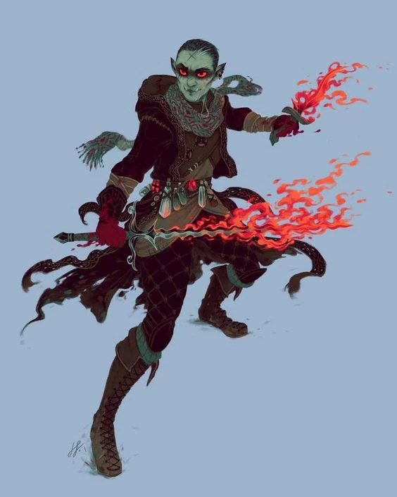
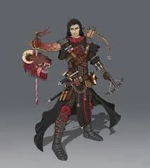

Used to go around killing dangerous creatures for people. Reduced to barely just a few members after the great Lycan incident.

<!-- onenote-media:start -->
> [!onenote-hero]
> 

> [!onenote-gallery]
> 
<!-- onenote-media:end -->

They were called in but it turned into a massacre as some of the members were turned into lycans as well. They quelled the lycanthrope uprising at the price of many of their own members.

They are sometimes hired to hunt for monsters far away from their own lands (Wolven mountains) these days.

<!-- vault-enrichment:start -->
## Related

- [[settings/Middleworld/Organizations/index|Organizations]]
- [[settings/Middleworld/index|Introduction]]
- [[settings/Middleworld/History/index|History]]
<!-- vault-enrichment:end -->
