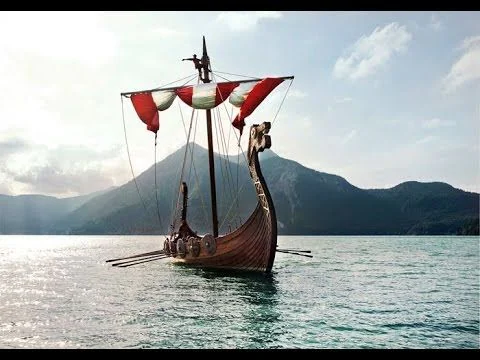
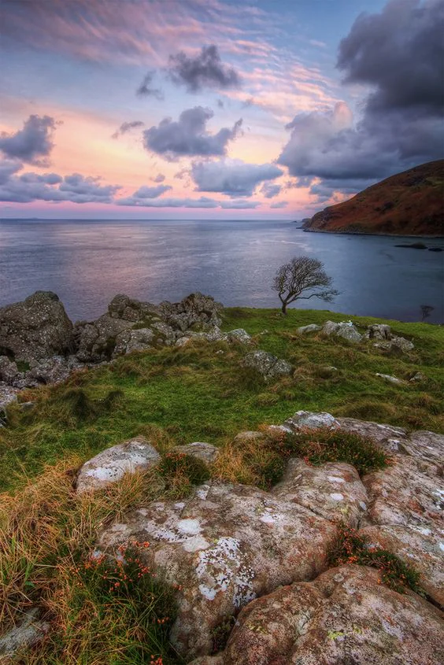

Said to the the location of the castle of the Lord of Pirates. They wear many faces (most probably after the previous ones are assassinated) but the legend of the untakable "Floating Black Citadel" remains and ensures that all pirates feel safe from the grasp of law in these waters.

<!-- onenote-media:start -->
> [!onenote-hero]
> 

> [!onenote-gallery]
> 
<!-- onenote-media:end -->

<!-- vault-enrichment:start -->
## Related

- [[settings/Middleworld/Regions/index|Geography]]
- [[settings/Middleworld/index|Introduction]]
- [[settings/Middleworld/History/index|History]]
- [[settings/Middleworld/Maps/index|Maps]]
<!-- vault-enrichment:end -->
