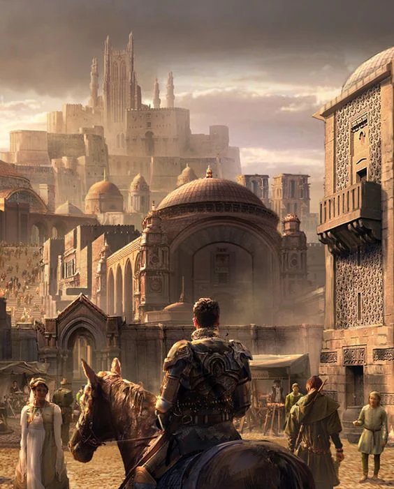
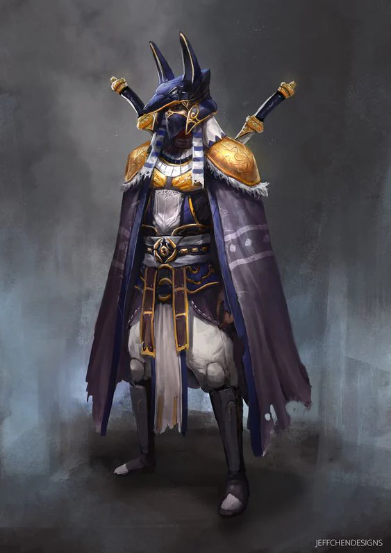
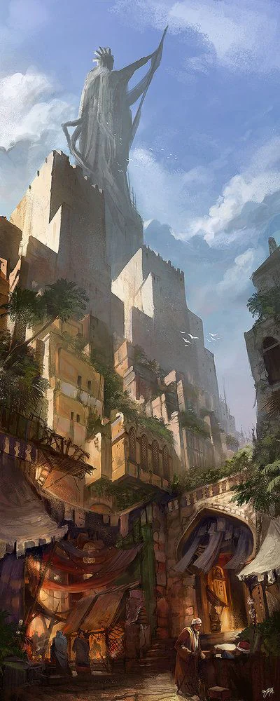

The city of Jaloss boasts an inexplicably large amount of Gems and Jewels that they trade with the Varesh. The people of this place all wear masks at all times.

<!-- onenote-media:start -->
> [!onenote-hero]
> 

> [!onenote-gallery]
> 
>
> 
<!-- onenote-media:end -->

