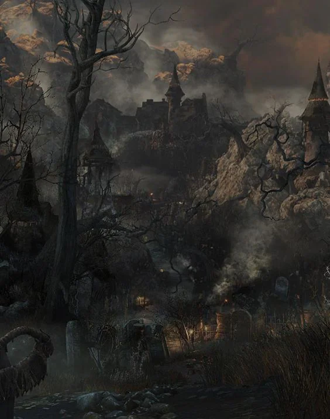
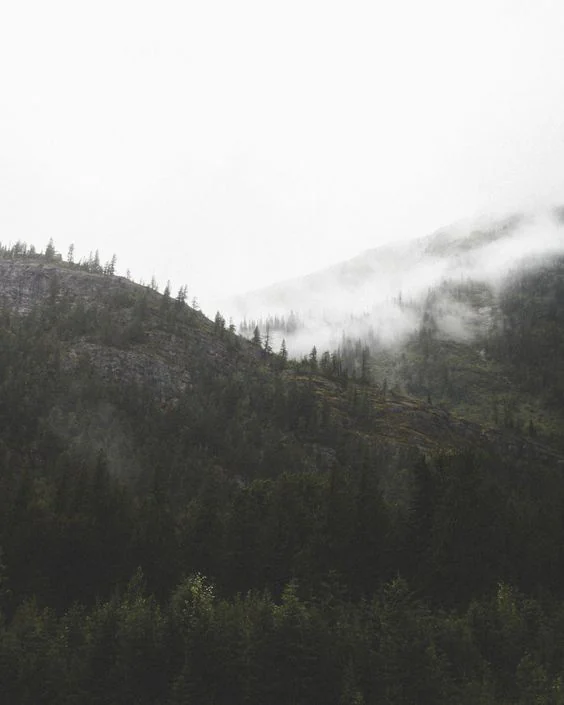
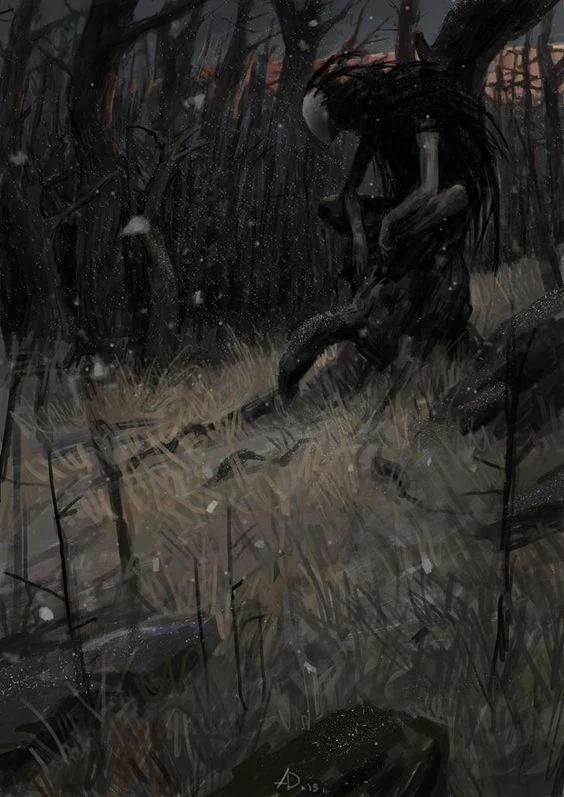
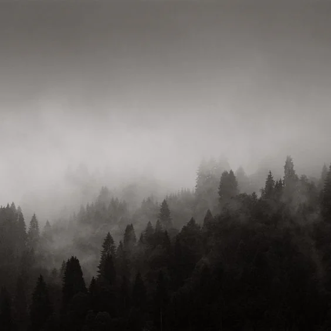

Small province stuck in the valley of the wolven mountains. Cromer is the seat of the greatest known order of monster slayer. The Province was struck by a plague that left the work of monster slaying mostly unfulfilled for a long while. Dangerous monsters still roam.

<!-- onenote-media:start -->
> [!onenote-hero]
> 

> [!onenote-gallery]
> 
>
> 
>
> 
<!-- onenote-media:end -->

<!-- vault-enrichment:start -->
## Related

- [[settings/Middleworld/Regions/index|Geography]]
- [[settings/Middleworld/index|Introduction]]
- [[settings/Middleworld/History/index|History]]
- [[settings/Middleworld/Maps/index|Maps]]
<!-- vault-enrichment:end -->
