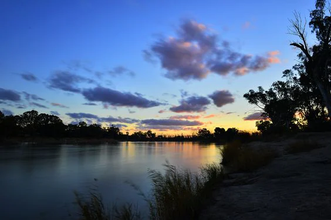
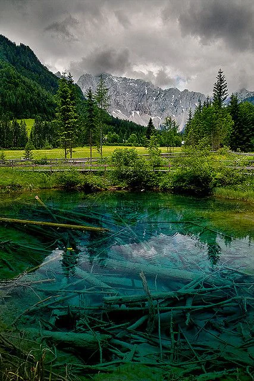

Untamed lands filled with monsters, it is said that those brave enough to thread these lands eventually reach the Sea of Visions where they may perform a ritual to have their future foretold.

<!-- onenote-media:start -->
> [!onenote-hero]
> 

> [!onenote-gallery]
> 
>
> 
<!-- onenote-media:end -->

<!-- vault-enrichment:start -->
## Related

- [[settings/Middleworld/Regions/index|Geography]]
- [[settings/Middleworld/index|Introduction]]
- [[settings/Middleworld/Maps/index|Maps]]
<!-- vault-enrichment:end -->
