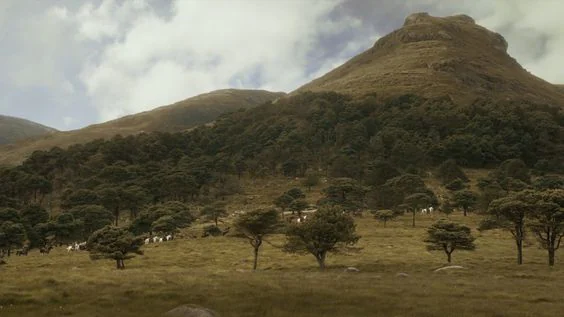
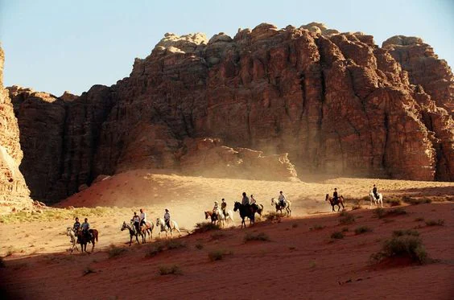
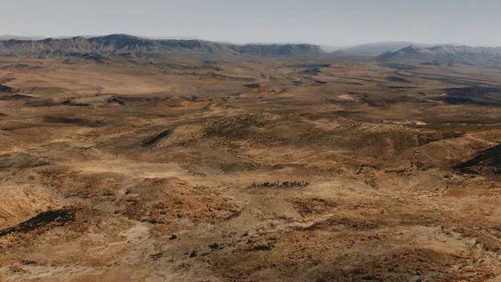

Plains that evolve into an unending and uncharted desert. Some people claim some nomads walk this desert from oasis to oasis, but no record has been found.

<!-- onenote-media:start -->
> [!onenote-hero]
> 

> [!onenote-gallery]
> 
>
> 
<!-- onenote-media:end -->

