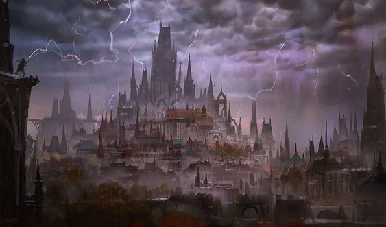
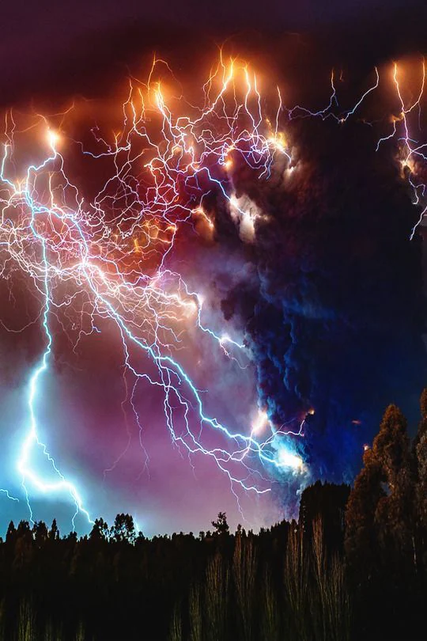

A cursed location that has fallen into eternal darkness. A constant storm brews over it. Little is known of this location's situation and what lives in it. The plains of Oplana are mostly uninhabited although some records of these places are left.

<!-- onenote-media:start -->
> [!onenote-hero]
> 

> [!onenote-gallery]
> 
<!-- onenote-media:end -->

<!-- vault-enrichment:start -->
## Related

- [[settings/Middleworld/Regions/index|Geography]]
- [[settings/Middleworld/index|Introduction]]
- [[settings/Middleworld/Cosmology/Pantheon|Pantheon]]
- [[settings/Middleworld/History/index|History]]
- [[settings/Middleworld/Maps/index|Maps]]
- [[settings/Middleworld/Society/The people|The people]]
<!-- vault-enrichment:end -->
