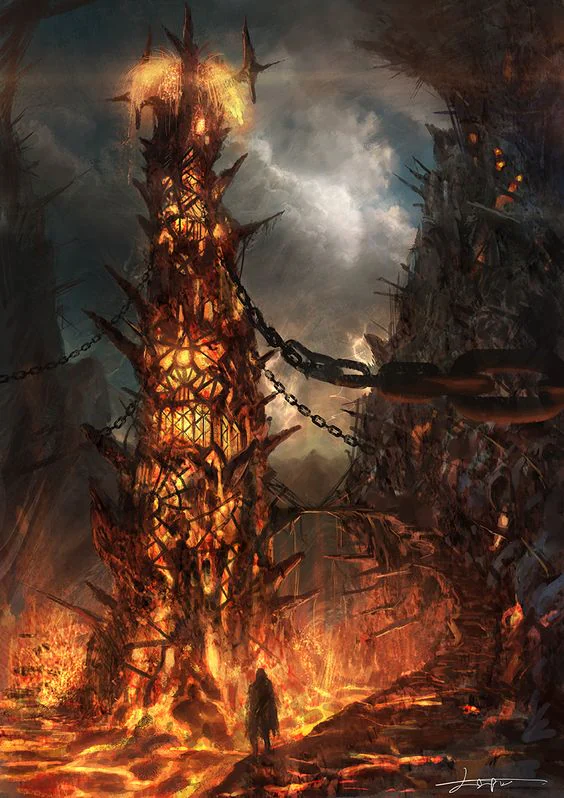
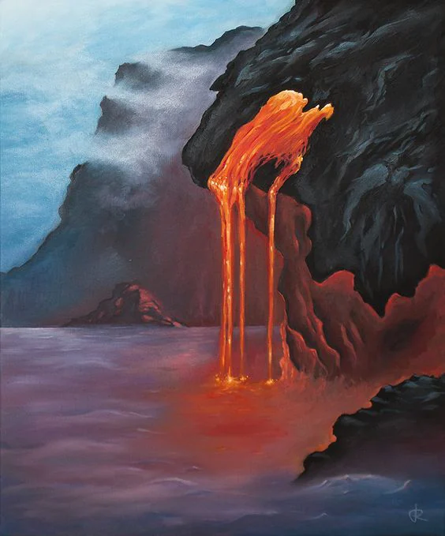
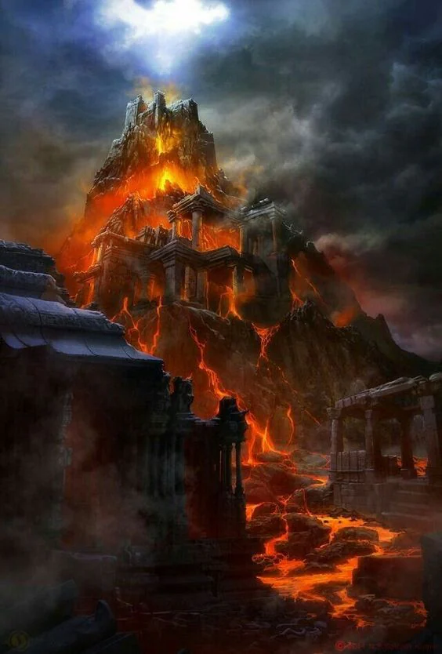

These islands are said to be the gateway to different planes: Negative energy plane and the elemental plane of Fire

<!-- onenote-media:start -->
> [!onenote-hero]
> 

> [!onenote-gallery]
> 
>
> 
<!-- onenote-media:end -->

<!-- vault-enrichment:start -->
## Related

- [[settings/Middleworld/Regions/index|Geography]]
- [[settings/Middleworld/index|Introduction]]
<!-- vault-enrichment:end -->
