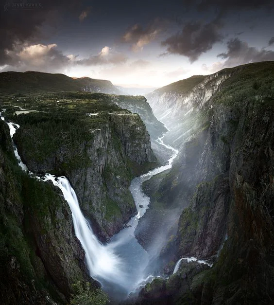
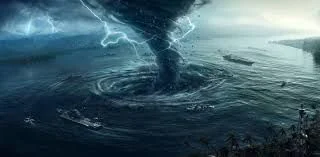

Mountainous regions said to harbour small communities of cultists, it is also the location of a swirling maelstrom said to be the gateway to the plane of elemental Air.

<!-- onenote-media:start -->
> [!onenote-hero]
> 

> [!onenote-gallery]
> 
<!-- onenote-media:end -->

<!-- vault-enrichment:start -->
## Related

- [[settings/Middleworld/Regions/index|Geography]]
- [[settings/Middleworld/index|Introduction]]
- [[settings/Middleworld/Maps/index|Maps]]
<!-- vault-enrichment:end -->
