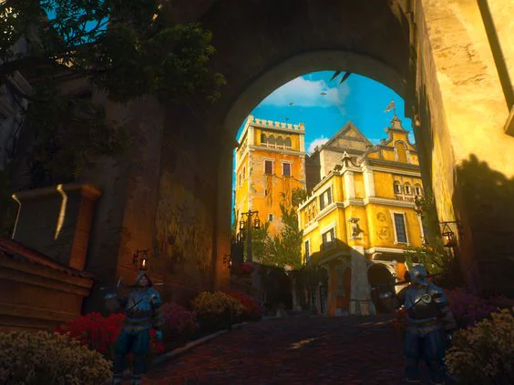
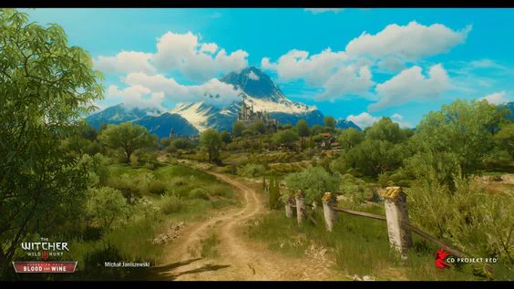
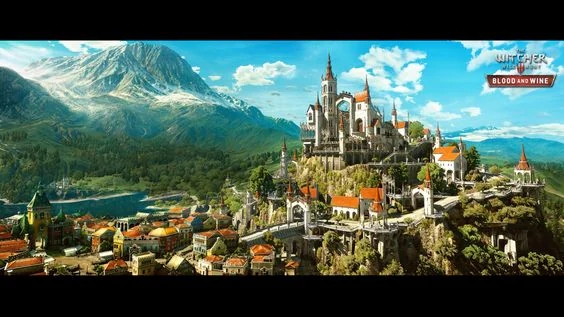

Western and Eastern Illorain were the first provinces conquered by the 1st Emperor. They are known for their refined goods such as wine, jewely work, enchantments and tailoring.

<!-- onenote-media:start -->
> [!onenote-hero]
> 

> [!onenote-gallery]
> 
>
> 
>
> 
<!-- onenote-media:end -->

Laroix is the brithplace of the current Empress whereas Val Soine is home to one of the most prestigious military academies.

<!-- vault-enrichment:start -->
## Related

- [[settings/Middleworld/Regions/index|Geography]]
- [[settings/Middleworld/index|Introduction]]
- [[settings/Middleworld/Maps/index|Maps]]
<!-- vault-enrichment:end -->
