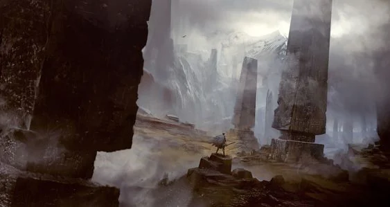

A patch of land with an unusually warm climate. The obelisks that dot this part of the world are said to be magical devices made to seal away something. The central Obelisk did not fire properly as the cold weather can attest. These obelisks are untended, humming and the people living in these parts of the world are contend with them.

<!-- onenote-media:start -->
> [!onenote-hero]
> 
<!-- onenote-media:end -->

The people living in this part of the world live in a self sustaining environment and hear little from the outside world. Some scholars come here to study these obelisks, others come here to make a pilgrimage through roads and ferryways that allow for travel through this area.

This area should be ruled by a king, but their bloodline has run out a long time ago.

<!-- vault-enrichment:start -->
## Related

- [[settings/Middleworld/Regions/index|Geography]]
- [[settings/Middleworld/index|Introduction]]
- [[settings/Middleworld/Factions/Veilin Fae Folk|Veilin Fae Folk]]
- [[GM-thoughts/Middleworld/Founding Myth|Founding Myth]]
- [[settings/Middleworld/History/index|History]]
- [[settings/Middleworld/Maps/index|Maps]]
<!-- vault-enrichment:end -->
