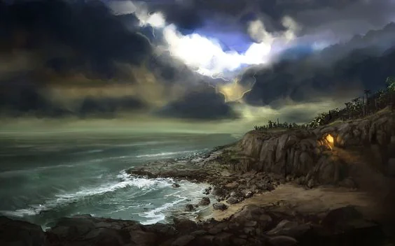
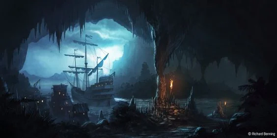
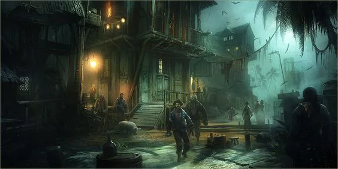

Unclaimed land due to the ground being very marsh-like and sinking. Some say groups of pirates and exiles have claimed it and live in small communities.

<!-- onenote-media:start -->
> [!onenote-hero]
> 

> [!onenote-gallery]
> 
>
> 
<!-- onenote-media:end -->

<!-- vault-enrichment:start -->
## Related

- [[settings/Middleworld/Regions/index|Geography]]
- [[settings/Middleworld/index|Introduction]]
- [[settings/Middleworld/Maps/index|Maps]]
<!-- vault-enrichment:end -->
