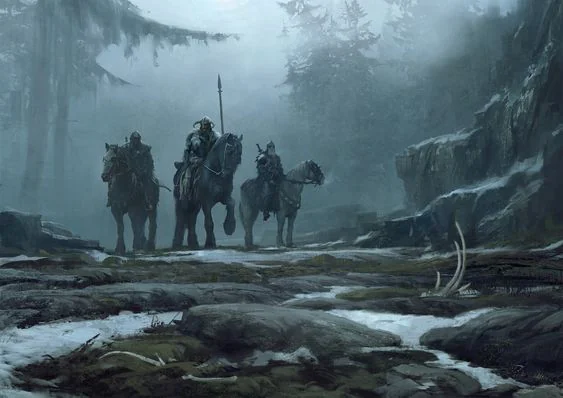
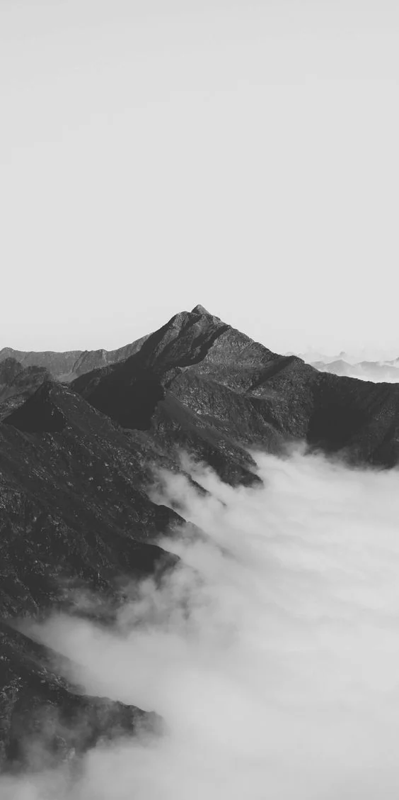

Wildlands that have the only road to the [[settings/Middleworld/Factions/Varesh|Varesh]] desert. This flatland is home to a sleeping volcano called the Obsidian Mountain. It is said this mountain is a gateway to the elemental plane of Earth

<!-- onenote-media:start -->
> [!onenote-hero]
> 

> [!onenote-gallery]
> 
<!-- onenote-media:end -->

<!-- vault-enrichment:start -->
## Related

- [[settings/Middleworld/Regions/index|Geography]]
- [[settings/Middleworld/index|Introduction]]
- [[settings/Middleworld/Maps/index|Maps]]
- [[settings/Middleworld/Factions/Varesh|Varesh]]
<!-- vault-enrichment:end -->
