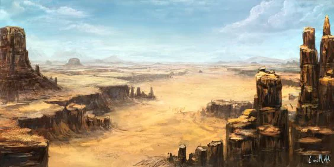
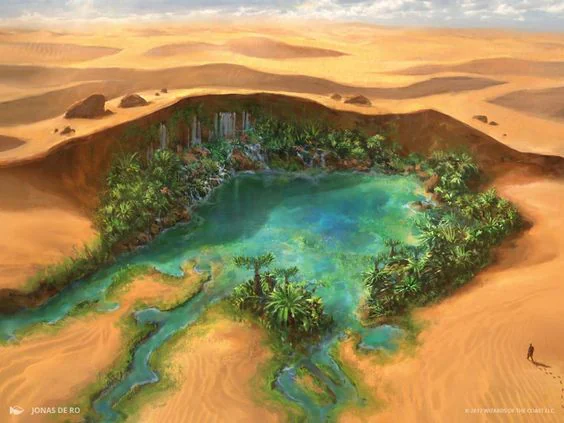

Blessed location, this shining sand desert is threaded only by the devout and is said to be the locations of portals towards the positive Energy plane.

<!-- onenote-media:start -->
> [!onenote-hero]
> 

> [!onenote-gallery]
> 
<!-- onenote-media:end -->

