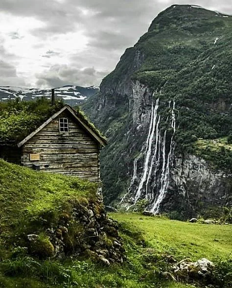

Northern Province of the Empire. It is mostly known for its export of wood and carpentry work. The main city of this province is Sarton. This city sports the oldest known wooden castle, rebuilt several times. It serves today as a meeting location for the local lords and merchants.

<!-- onenote-media:start -->
> [!onenote-hero]
> 

> [!onenote-gallery]
> 
<!-- onenote-media:end -->

