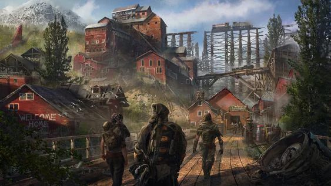
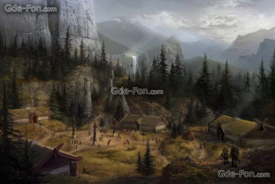

Final and Westernmost province of [[settings/Middleworld/Society/The Empire|the Empire]]. Poorer region of the Empire, they provide mostly stone and stoneworkd for the rest of the Empire.

<!-- onenote-media:start -->
> [!onenote-hero]
> 

> [!onenote-gallery]
> 
<!-- onenote-media:end -->

<!-- vault-enrichment:start -->
## Related

- [[settings/Middleworld/Regions/index|Geography]]
- [[settings/Middleworld/index|Introduction]]
- [[settings/Middleworld/History/index|History]]
- [[settings/Middleworld/Maps/index|Maps]]
- [[settings/Middleworld/Society/The Empire|The Empire]]
<!-- vault-enrichment:end -->
